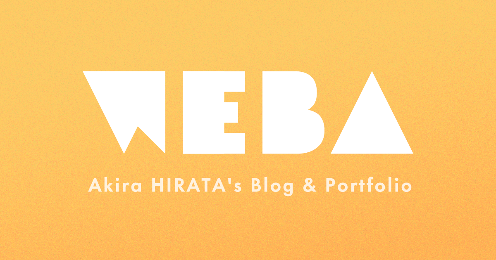

 
 

# WEBA
* My Blog & Portofolio website.
* https://hira.page/

 

## Design
* UI: [Figma](https://www.figma.com/file/FCrd1uYqTKyUW16MtbWU8C/hira.page)
* Assets: [./design](design)

 

## Develop
do | commands
--|--
develop vue | `$ npm start`
a | `$ npm run start:hugo`
a | `$ npm run start:vue`
a | `$ npm run new`
a | `$ npm run build`

 

## Files Structure

#### design
- Webサイトのデザイン、各種素材の編集ファイルです。

#### docs
- 最終的にビルドされる公開用ファイルです

#### hugo-amp-contents
- ブログの記事用です。
- `/public` 配下に以下のファイルを生成し、Vueのページ内で使用されます。
  - `blog/`: amp形式でビルドされたブログページのHTMLファイルです。
  - `index.xml`: RSS用ファイルです。
  - `sitemap.xml`: SEO用のサイトマップファイルです。
- [hugo](https://gohugo.io/)のインストールが必要です

#### src
- Vue用のソースファイルです。

 

## メモ
- `⌘⌥V` でMarkdown中に画像を保存できます。
  - VS CODE 拡張機能
- SendGridを使うには `.env.local` が必要
