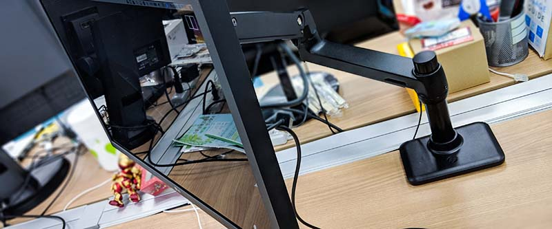
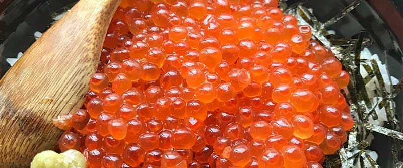

2018年に購入・契約してよかったものをまとめました。今年はQOLアゲアゲが目標だったので、いろいろ買ってます。ガジェット、サブスクリプションサービス、猫、その他のカテゴリにまとめます。カテゴリごとになんとなく買ってよかった順に書いてます。

## 買ってよかったもの ― ガジェット編
PC・スマホなどデジタルガジェット関連です。

### [Pixel 3](https://store.google.com/jp/product/pixel_3)

僕にとっては今年一番の買い物でした。Pixel3を購入するまではNexus6PとiPhone7を使用していたのですが、それらとは一線を画すスマホでした…。Android Pie 9.0が非常によくできており、個人的にはiOSよりも使いやすくて好きです（これには反対意見も多そうですが、そう感じる人はAndroidに慣れてないだけだと思ってます）。

またカメラの体験が圧倒的に良いです。

- フロントカメラが超広角で、自撮り棒が不要
- ポートレート撮影がとてもボケる。さらに撮った後にぼかしの位置を変えられる
- 夜景モードではほとんど光がない暗闇でも結構撮れる
- Google Photos に無制限でオリジナル画質の写真を保存できる
  - クラウドとの連携が非常にスムーズで大量の写真の加工・管理も簡単
- AR機能でアベンジャーズやスターウォーズのキャラと撮影できる
- 被写体を機械学習により判別し、Webから検索してくれるGoogle Lens
- 「電源ボタンのダブルクリックでカメラ起動→隣の音量ボタンで撮影」ができるので、撮りたいと思ったら縦持ち・横持ち問わずにすぐに撮影できる

iPhoneの様にレンズ自体を増やしたり性能向上させているのではなく、撮影後の機械学習による加工でよい写真を作り上げているようですね。このへんの詳しい話は[@goando](https://twitter.com/i/moments/1057656588255674369)氏のTwitterモーメントが参考になります。

### [LG UltraFine 4K Display](https://www.apple.com/jp/shop/product/HKMY2J/A/lg-ultrafine-4k-display) + [HPシングルモニターアーム BT861AA](https://amzn.to/2GbHJhM)

Mac用公式ディスプレイとして販売されているLGの液晶ディスプレイと、HPのモニターアームです。会社のデスクに（経費で）導入しました。

モニターアームはHP（ヒューレット・パッカード）の名前がついていますが、実際はエルゴトロンのOEM製品であり、エルゴトロンLXとほとんど同じ製品です。エルゴトロンLXはド定番のモニターアームで、位置調整の操作がやりやすく人気です。BT861AAはエルゴトロンLXの塗装のみ変えたものであり、マットブラックの質感が最高にLG UltraFine 4K Displayと良く合います。また、LG UltraFine 4K Displayは本来ピボット（縦回転）できないのですが、アームをつけることでそれも行えるようになります。

LG UltraFine 4K Displayは完全にMac専用として設計されており、ディスプレイ側に余計なボタンはいっさいありません。繋げば電源ON、切断すれば電源OFF、輝度はつなげたMacのTouchBarから変更できます。さらに、このディスプレイの素晴らしいところは、**電源・ストレージ・LAN・映像・音声をたった1本のUSB Type-Cケーブルで管理できる**ところです。モニターの方にACアダプター、LANケーブル、HDDなどをつないでおけば、Macとモニターを1本のケーブルでつなぐだけで、すべての機器がMac繋がります。そのため、机の上にはケーブルが1本しか見えません。

かなり苦労して探した分あり、これらの組み合わせは完璧に美しく、大変満足しています。

### [MacBook Pro 2018later](https://www.apple.com/jp/macbook-pro/)

TouchBarつきMacのうち、2018年後半に出たモデルです。

初期のモデルにあった、「キーボードが押しづらい・ディスプレイ出力が不安定」等の問題はわりと解決されており、とても良好に使えます。Mac OS 12 もとくに不満はなく、`⌘⇧5`で使えるようになったスクリーンキャプチャ機能がとても便利です。

### [Oculus GO](https://www.oculus.com/go/)

Facebookから今年発売された安価なVR HMD（ヘッドマウントディスプレイ）です。カスタムされたAndroidOSが搭載されており、PCやスマホ無しにスタンドアロンで動作します。使い勝手がとてもよく、スリープのまま置いておき、使いたい時にすぐ使えます。
これまでの<b>高い・重い・起動がめんどくさい</b>という欠点をかなり克服しており、HMDの普及にかなり貢献した名機だと言えます。ただバッテリーは短めです。

Google Earth で指定した場所へ実際に行った気分になれる[Wander](https://www.oculus.com/experiences/go/1887977017892765/)というアプリがとても良く、昔住んでいた場所に行って切なさで死にたくなったりできます。デフォルトでインスコされているアプリも楽しいものが多いです。

もっとも来年に発売が予定されている[Oculus Quest](https://www.oculus.com/quest/)を買ったらこちらは売ってしまうかもです。

### [Kindle Paperwhite 2018laterモデル](https://amzn.to/2QqfZur)

買ったのは2018年12月ですが、この記事に追加しました。先月発売されたばかりのKindle新モデルです。今回から**防水**になりました。もともとiPhone7を使って入浴しながら本を読んでいたのですが、ずっとKindleで読みたいと思っていたのですぐに購入しました。

Amazonサイバーマンデーのセールにて4000円オフで購入しましたが、定価だとすこし高めかもしれません。見た目もすこしかわりましたが、いまのところ防水になった以外で大きな変更は感じません。

### [SONY Bluetoothイヤフォン WI-SP500](https://amzn.to/2L0yoIb)

SONYから今年発売されたBluetootheイヤフォンです。同時発売で左右完全分離型やノイズキャンセリングのモデルも出ていますが、この形が一番シンプルで使いやすいです。世間には[耳からうどんをたらして](https://www.google.co.jp/search?q=耳からうどん&tbm=isch)悦に入る方もいらっしゃるようですが、この形のBluetoothイヤフォンこそ完成形だと僕は思っています（あとは無線充電がつけば完璧）。

ちなみに音質はそんなによくありません（前使ってた[JBLの方](https://amzn.to/2G3M3iL)がよかった）。

### [おまけ： 買って微妙だったSurface Go](https://www.microsoft.com/ja-jp/p/surface-go/)

ずっと「10インチでまともに開発ができる端末がほしい」、とくに「Surfaceの10インチが出てほしい」と思っていた（5年くらい）ので、発表された途端すぐに予約、購入した端末です。期待が大きかったせいもあるでしょうが、予想以上に残念でがっかりしています。

まず届いたキーボードが想定と違うJIS配列のキーボードで、すぐに電話して返品、交換しました。ストアの写真がすべてUS配列キーボードで、仕様にも「Qwerty配列」としか書いていないのですが、日本のストアで販売されているのはJIS配列とのことです。[2018年12月現在も直っておらず](https://www.microsoft.com/ja-jp/p/surface-go-signature-type-cover/90KBCCPW6FSV)、非常に誤解を生むページです…。そもそも日本ではMS Officeの抱き合わせ版しか購入できず、ムダに高くなっているのも不満です。

次に実際の製品なのですが、とにかく動作がぎこちなく、表示バグやフリーズも多くていらいらしてしまいます。性能が低いのは理解していたのですが、それにしてもWindowsというOSのUI・UXのレベルが低く、遅い端末ではまともに使えたものではありません。（ちなみに僕はずっとWindowsユーザだったので慣れていないわけではないです。）お絵かきにも使いたいと思っていたのでペンも買ったのですが、遅延がひどすぎてあまり早くペンを動かすと線がついてきません。

もっともハードの見た目自体はとても良くできています。サイズ感もちょうど良く、質感も素敵です。まともに動いてくれさえするならいつも持ち歩く愛機になってくれたでしょう…。子供のおもちゃや、趣味でたまに使う程度ならちょうど良い端末かもです。

---

## 買ってよかったもの ― サブスクリプション編
月額支払いで利用できるサービス・設備などです。「契約してよかったもの」ですね。

### [Prime Wardrobe](https://www.amazon.co.jp/b/?node=5425661051)

Amazonが今年から始めたPrime会員向けのサービスです。1度に8点まで服や靴、カバンなどを自宅に送ってもらい、**気に入ったものだけ購入して不要なものは返送**できるサービスです。返送手続きも簡単で、送られてきたダンボールに不要な商品を戻し、同梱されている着払いの伝票を貼り、ヤマトなどに集荷依頼するだけです。服の購入は時間をかけて考えたいですし、**自宅の持っている服と合わせて試着できる**のでとても便利です。まだ3回ほどしか使用していませんが、今後もずっと使う予定です。いまのところ品揃えはそんなによくありません。

### [YouTube Premium](https://www.youtube.com/premium)

やっと日本でも使えるようになったYouTubeの有料プランです。アプリでもWebでも広告が出ない、バックグラウンドでの再生などとても快適です。

また、Premiumに入るとYouTube Musicサービスが使えるようになり、そちらがとくに気にいってます。（[YouTube Musicの単体プラン](https://www.youtube.com/musicpremium)もあります。） 僕はSpotifyやAppleMusicをあまり使っていないので比較することは避けますが、単純にもともとYouTubeで音楽を聴いていたので、それがとても便利になって快適です。機能も良くできており、あまり考えずにレコメンドされた曲だけ聴いていれば幸せになれます。

3ヶ月は無料で利用できるので、もともとYouTubeで音楽をいるようなひとはぜひ試すとよろしいかと。

### [ウォータースタンド](https://waterstand.jp)

温・冷の浄水が出るウォータースタンドです。いわゆるタンク交換式のウォーターサーバーではなく、<b>水道直結なので交換の手間がまったくありません</b>。いつでも熱湯と冷水がすぐに使えるのはとても便利で、料理や嗜好品にとても重宝します。もともと冷蔵庫で麦茶を作っていたのですが、その手間もなくなりました。[保温・保冷ポッド](https://amzn.to/2KZCG2l)を2つ買ったので、冷水とコーヒーをそばに置いて飲んでいます。

月額4,000円程でちょっと高いですが、わりと満足しています。

### [ANYTIME FITNESS](https://www.anytimefitness.co.jp/)

トレーニングジムです。契約すれば24時間、世界中どこの支店でも利用できます。

とにかく楽・気軽に続けたかったので、徹底的に荷物を減らして習慣づけるように意識しました。荷物は[パウチ型のプロテイン](https://amzn.to/2KWsiII)と[足袋型のトレーニングシューズ](https://amzn.to/2KWI5HJ)と短パンだけなので、普段のリュックに余裕で入ります。ジムで2回着替えるのも面倒なので、自宅の近くにあるジムを選び、運動したらそのまま帰って家でシャワーを浴びます。↑で紹介した、Pixel3、Bluetoothイヤフォン、YouTube Musicを使ってテンション上がるプレイリストを流しながら走っています。

1回の時間は1時間いないくらいですが、おかげでなんとか週3・4くらいで通えています。

---

## 買ってよかったもの ― 猫編
飼ってる猫に捧げたグッズです。

### [ペーパーヨーヨー](https://amzn.to/2KXR9fj)

**お祭りの夜店でよく売ってた降ると伸びる紙の棒**です。こんな名前だったらしいです。すぐ壊れる消耗品ですが、安いし楽しいです。

### [カリカリマシーンSP](https://amzn.to/2G0JNcb)

自動給餌器です。決まった時間に決まった量の餌を出せる他、自宅の外から餌を出したり、カメラで様子を見たり、声をかけたりできます。何度か使用しましたがとくに問題も起きず、2泊3日の旅行程度ならなんとかなります。値段の割には高性能で満足しています。

### [アイリスオーヤマ カーペットクリーナー](https://amzn.to/2KYU5bA)

同じく猫を飼っている[@onthehead](https://twitter.com/onthehead)氏に教えて頂いたグッズです。猫は季節の変わり目に大量に毛をばらまくので、それをコロコロするのに使っています。黒い服はいっしゅんで毛だらけになるので、猫飼いには必須です。もちろん普通にカーペットにもコロコロできます。一般的なコロコロと違ってべたべたの紙が斜めに切れており、簡単に汚れた部分を捨てられます。

### [じゃれ猫 LEDにゃんだろー光線](https://amzn.to/2L5aRpL)

レーザーポインターです。猫の食いつきが半端ない上、猫じゃらしと違って人間は疲れません。とても楽。

---

## 買ってよかったもの ― その他編

### [宅配ボックス](https://amzn.to/2KXVLC7)

頻繁にamazonで買い物するのですが、受け取りが面倒なために導入しました。自宅のドアの前にチェーン付きで置くだけです。導入コストは低かった割にめちゃくちゃQOL上がりました。
※ 住居によっては自宅前に置けないことも多いので、事前に確認することをオススメします。

### ふるさと納税

「買った」とは言えないかもですが、今年からふるさと納税をはじめてみました。返礼品は人気ランキング上位のものを適当に選び、**冷凍イクラ1kg、冷凍豚肉いろいろ詰め合わせ、米15kg**を入手しました。冷凍イクラは美味しい上に1年近く日持ちするため最高でした。

[楽天ふるさと納税](https://event.rakuten.co.jp/furusato/)から申し込んだのですが、手続きも簡単でした。

---

## おわり

以上です。こういう記事書いてみたかったのでとても楽しかったです。来年は洗濯機・掃除機あたりを購入予定です。ガジェット好きなかたは是非いろいろご教示してくださると嬉しいです。ちなみにこれから買いたい物については、[Amazonのほしいものリスト](http://amzn.asia/eoKfIyd)にまとめているので、いつでも支援お待ちしています 🤗

お付き合いただきありがとうございました。
