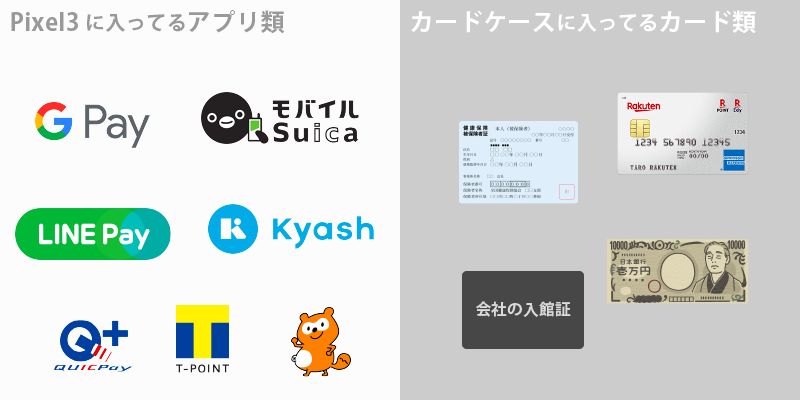

先日Pixel3というスマホを購入して以来、財布を持ち歩くのをやめました。**持ち歩いているのはPixel3とカードケースのみ**で、主に支払いアプリのGoogle Payとクレカだけで支払いを行います。

2か月この生活を続けてみてよかったこと、わるかったことをまとめ、その後どういった構成になっているか詳細に紹介します。

## よかったこと

### 🙆 レジでの時間が圧倒的に減った
金額を聞いて、適切なお金を財布から出して、店員の処理を待って、お釣りを受け取って…という手間が消えます。**シンプルに超便利**です。また、ポイントカードもできるだけスマホ内で使うようにしたので、探す手間もだいぶ減りました。

### 🙆 ATMに行く回数が超減った
そもそも「あ、金が足りない」がなくなります。

### 🙆 知人間のやりとりの手間が減った
後述する送金アプリのおかげで割り勘時などにだいぶ楽になりました。

「いま無いから後で払うわ」とか、「5000円崩せる？」「お釣り出る？」とか、まとめて払った人がみんなから集金して小銭でいっぱいになっちゃったりとか、バカバカしくなります。

### 🙆 荷物が減った
これまでも[abrAsusの薄い財布](https://superclassic.jp/?pid=16355432)を使っていましたが、それすら今では大きく感じます。

### 🙆 ログが明確に残る
Google Payでの支払いも、送金アプリの利用もすべて自動的にログが残ります。定番の家計簿アプリ[MoneyForward](https://moneyforward.com/)との連携も可能です。

よく「現金使わないと金銭感覚わからなくなって使い過ぎてしまう」という声も聞きますが、慣れればこちらのほうが明確に管理できるはずです。

### 🙆 普段の支払いにキャッシュバックがつく
ご存知の通りクレジットカードは使うたびにポイントなどの還元があります。

さらに僕の場合は、使うたびにKyashのポイント還元2%もつくので、楽天カードの1%ポイント還元とあわせて、**支払いの3%分の還元を受けられる**ことになります。（構成は後述します。）

## わるかったこと

### 🙅 小銭がとても邪魔
ほとんどの店では使えますが、個人経営の飲食店・ラーメン屋だと現金のみのところが多いです。

そういうときはカードケースに忍ばせた予備の万札で支払います。小銭は泣く泣くポケットにつっこみ、家で貯金箱に放り込みます。たまった小銭はATMに返します。

### 🙅 送金アプリを使っていない人とやり取りするのが面倒
送金アプリを使っていない人と割り勘するときに結構めんどくさいです。端数は無視するとしても、そもそもこちらは1万円札しか持ち歩いていないことが多いのでちょっと相手に手間をかけてしまいます。

## 支払いの方式の詳細
具体的にどういうサービス・アイテムで支払いを行っているか紹介します。

### 構成
{{}}

- Pixel3（Androidスマホ）
  - Kyash, LINE Pay
  - Google Pay
      - QUICPay
      - Suica、Suica定期券
      - 各種ポイントカード

- カードケース
  - クレジットカード
  - 保険証
  - オフィス入館証
  - 予備の1万円札

### Kyash, LINE Pay
送金アプリです。ユーザ間でお金を送りあえるアプリで、割り勘のときに重宝するやつです。<b>KyashかLINE Payどっちかは使ってる人が多いので、この2つを入れておけばわりと完結します</b>。





支払い側はクレカや銀行振込と連携して送金し、受け取り側はポイントとしてお金がチャージされます。

KyashもLINE Payも**それぞれと連携したクレジットカードを作成でき、チャージされたポイントをクレカとして使用できます**。

### Google Pay
Google PayではQUICPay、Suicaの非接触型決済と、ポイントカード類の表示に使用しています。

基本的にはApple Payとそんなに違いありません。対応サービスはApple Payの方が多いですが、Google Playのほうが便利さでは勝ってる印象です。ただし非接触型決済に対応しているAndroidスマホは現状かなり少ないです。

ほかにもnanacoやWAON、Edyなども利用できます。Apple Payと違い、**いちいちスマホを起動して選ばなくても、支払い端末にタッチすれば対応した方法で支払ってくれます**。

<small>※ ちなみにPayPayなどQRコード提示する系もインストールしているのですが、手順が面倒すぎてまったく使い続ける気がしないです。[この記事](https://note.mu/takashi0zo/n/nf5c11a0baa0e)にわかりやすくまとまってますが、毎日使えるレベルではないと思います。</small>

### QUICPay（クレジットカード）
基本的にはこれで支払います。対応しているレジでピッとするだけで支払えるやつです。

整理しておくと、QUICPayというのは<b>支払いの規格</b>で、実際にはクレジットカードから払われています。

同様の規格にiDというのもあります。どちらが使われるかは提携しているスマホアプリとクレジットカードごとに決定されます。楽天カードをApple Payに登録すればQUICPayになり、Amazonカードを登録すればiDになる、といった具合です。どちらも多くのコンビニやチェーン店などで利用できます。

僕の場合はGoogle PayにKyashのクレジットカードを登録しています。ちょっとわかりづらいのですが、以下のような構成ですね。

{{}}

### Suica, Suica定期券
QUICPayが使えないところでもSuicaは使えたりします。事前にチャージする必要がある&ポイント還元もないのであまり使ってません。また、定期もSuicaにしてるので、改札もタッチ&ゴーです。

### 各種ポイントカード
**Google Payアプリの中でバーコードを表示でき、ポイントカードとして使えます**。以下のようなサービスに対応しています。この世のすべてのポイントカードはアプリ化してほしいですね。

- Tカード
- ニトリ
- IKEA
- マツモトキヨシ
- 楽天ポイントカード
- etc...

pontaカードはGoogle Pay内で上手く使えなかったので、別で[公式のpontaカードアプリ](https://play.google.com/store/apps/details?id=jp.ponta.myponta)を入れています。

### カードケース
マネーバンドも兼ねたカードケースです。あくまで予備用で、基本はスマホだけで完結させます。必要最低限のカードだけ入れています。美容院のカードやキャッシュカードなどは別のカードケースにまとめてカバンにはいっています。



## まとめ
ところどころ不便な面はありますが、基本的には財布をやめてすごく良かったです。ラーメン屋がある以上、真のキャッシュレス化はまだまだできなそうですが、財布をやめてメリットの方が大きい時代になったと思います。

とりあえず、使えるひとはコンビニで **Apple Pay、Google Payの利用だけ**でもつよくオススメします。レジのスピーディーさに慣れてしまうと、だんだん現金が嫌になってくると思います。

おわり
