## Alfredとは


Macで人気のランチャーアプリです。一番メインの機能としてはショートカットで表示される検索ボックスにアプリ名やファイル名を入れて、素早く起動させることです。[BetterTouchTool](https://folivora.ai/)や[Keyboard Maestro](https://www.keyboardmaestro.com/main/)と並んで、Macではド定番の作業効率化アプリです。

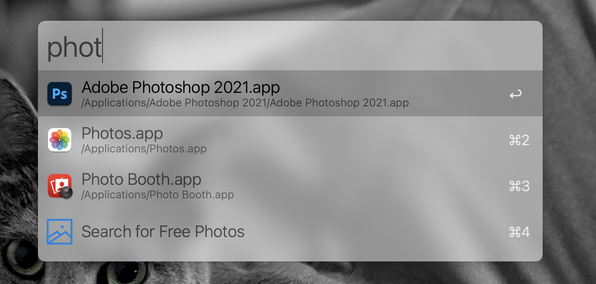

Macでデフォルトで入っている[Spotlight検索](https://support.apple.com/ja-jp/HT204014)機能とほとんど同じコンセプトなので、それの代わりに使うことになります。

なんとなく検索機能しか使ってないユーザーが多いのですが、Alfredはものすごく多機能でいろいろなことが行なえます。

## 基本の使い方
ここは知ってる方が多い前提なので、すでに使っている方は読み飛ばしてもOKだと思います。

### 起動
`⌥ Space` などのショートカットで検索ボックスが表示されます。もちろんショートカットはカスタム可能です。基本はすべての機能をこのボックスから行うことになります。

### アプリを検索
アプリ名を入力して検索し、すばやく起動できます。たいてい最初の1・2文字を入力すればすぐ見つかります。
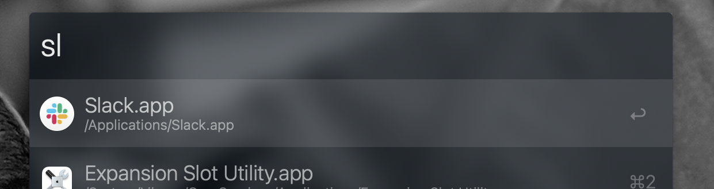

### ファイル・ディレクトリを検索
まず`Space`もしくは`'`を入力すると、ファイル検索モードになります。
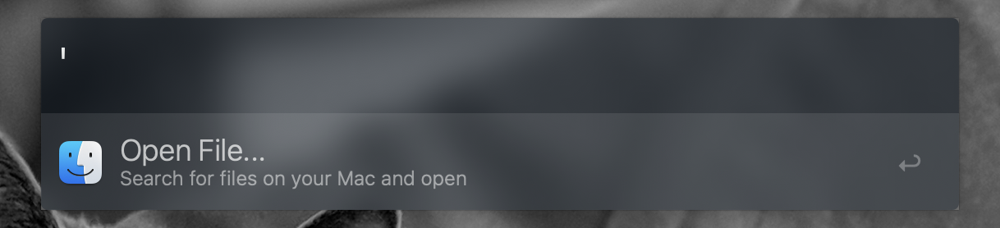
この状態でファイル名やディレクト名を入力すると、すばやく目的のファイルを開けます。

### Web検索
一致する結果がない単語を入力した場合、Alfredはデフォルトのブラウザを起動し、Google検索を行ってくれます。

### 電卓
数値を入力すれば計算できます。Enterを押すと結果がコピーされるので便利。
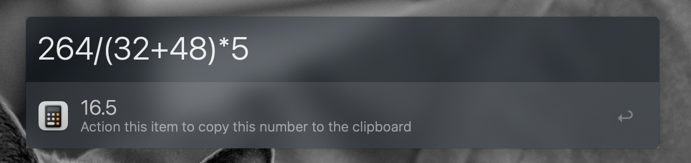

### システムコマンドを実行
`sleep`、`restart`、`emptytrash`などと入力することでMacを再起動させたりゴミ箱を空にしたりできます。他にも以下の画像にあるようなことができます。
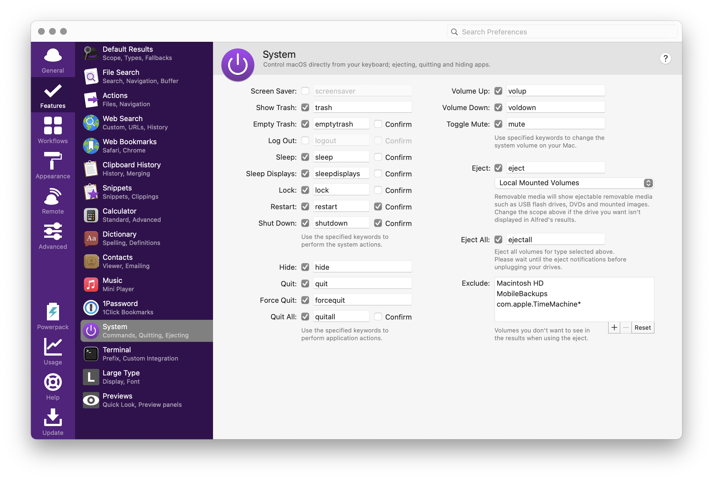

### Terminalコマンドを実行
`>` を入力したあと、Zshコマンドを入力すると、ターミナルが起動してそのコマンドを実行してくれます。起動するターミナルアプリは設定できます。

### 選択したテキストに対してAlfredを実行

### 設定
Alfredはカスタマイズしてなんぼのアプリなので、設定画面をよく開きます。検索ボックスを表示した状態で`⌘,`を入力するのがいちばん早いです。

検索ボックスで「al」と入力して`Show Alfred Preferences`やMacステータスバーのアイコンをクリックしても開けます。

## Powerpack
[Alfred Powerpack - Take Control of Your Mac and macOS](https://www.alfredapp.com/powerpack/)

Alfredの有料プランです。買い切り式ですが、特定のバージョンでのみ使えるプランと、アップグレード無料の永久ライセンスの2種類があります。

お値段は7,000円強と安くないですが、購入するだけの価値は十分にあると思います。以下、有料の機能をメインに紹介しているので、ぜひ検討なさってください。

そもそも無料版を使うなら、MacのSpotlightだけでいいような気がします。

## Clipboard
これがめちゃくちゃ便利です。このためだけに7,000円払ってもいいと思います。

Macでコピーした履歴を一覧で探して、再度ペーストができる機能です。この機能だけの類似アプリは様々あり、私も[Paste](https://apps.apple.com/jp/app/paste-clipboard-manager/id967805235)を使っていましたが、Alfredのほうが優秀に思います。

`⌘⇧V`などのショートカットで呼び出せて、いつでもコピー履歴を表示できます。テキストだけではなく、**画像のコピー履歴**も保存されます。
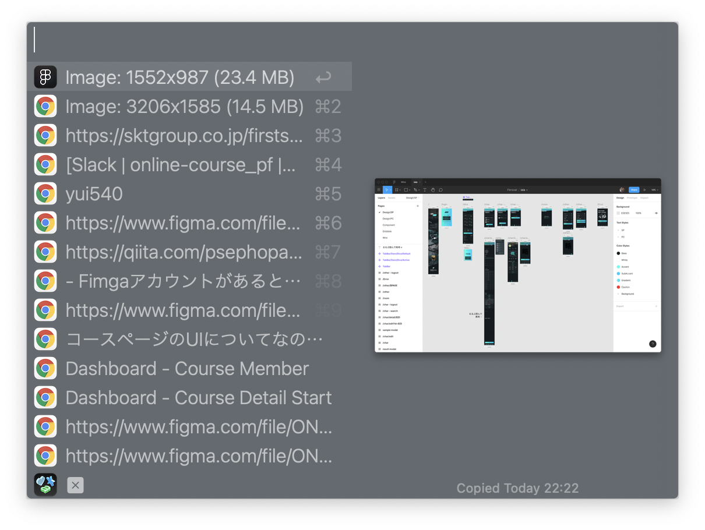
上下キーで再度貼り付けしたいものを選んで、`Enter`でペーストが実行されます。WordやHTMLをコピーしていた場合は書式込みでペーストされますが、`⇧Enter`でただのテキストとしてペーストすることもできます。

この状態でキーワードを入力することで、コピー履歴を検索できます。Imageと入力すればコピーした画像一覧が表示されます。

また、よく貼り付けるキーワードは設定のFeatures→Snippetsから保存しておくこともできます。私はデザインで利用するダミーテキストや、DNSアドレスなどを保存しています。

## Appearance
Alfredはすばらしいアプリなのですが、デフォルトの検索ボックスの見た目が鬼ダサくてとてもそのまま使えません。

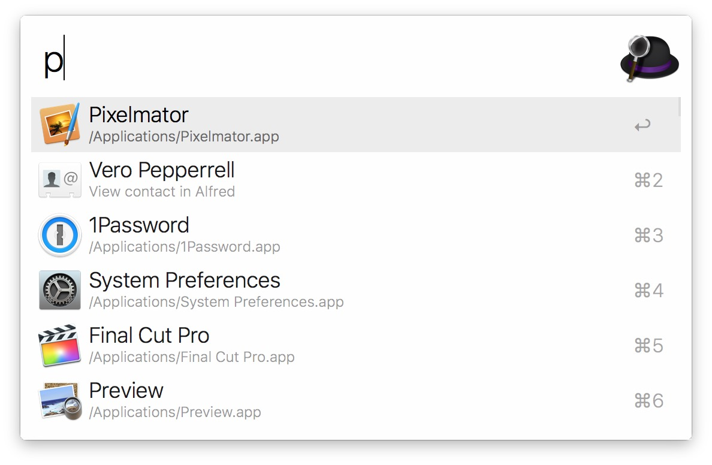

見た目は色や余白までかなり自由に設定できます。有志が公開しているThemeをDLして反映することもできます。

* [Alfred Theme - Glass--dark](https://www.alfredapp.com/extras/theme/jlgqHifMRw/)
* [Alfred Theme - Smoke](https://www.alfredapp.com/extras/theme/AUkf1A6h2G/)

## Web Search
特定のWebサイトでの検索を、Alfredからいつでもすぐに行えるようになります。

正確に言うと、**入力したキーワードをもとにしたURLを開く機能**です。

多くのWebサイトは検索キーワードがURLに含まれているので、それを前提にしているわけですね。たとえばYouTubeで「ゲーム実況」と検索する場合のURLは以下のようになります。
> <pre>https://www.youtube.com/results?search_query=ゲーム実況</pre>

このURLをもとにして、検索ワードの部分を`{query}`にして設定することで、すばやく検索を実行できます。
> <pre>https://www.youtube.com/results?search_query={query}</pre>

これを応用すると、DeepLで素早く翻訳を実行したりすることも可能です。

> <pre>https://www.deepl.com/translator#ja/en/{query}</pre>

## Workflow
Workflowとは、Alfredに対してさまざまな機能を追加するプラグインです。自分で作ることも可能で、有志が作った様々な機能が無料で入手できます。

例えば、[絵文字を検索して素早くコピーできるWorkflow](https://github.com/meyer/alfred-emoji-workflow)など、実に様々なものがあります。

正直、Workflowはすでに多くの方が紹介されてますし、職種によっても必要なものが異なるので、「[デザイナー Alfred おすすめ](https://www.google.co.jp/search?q=デザイナー+Alfred+おすすめ)」「[エンジニア Alfred おすすめ](https://www.google.co.jp/search?q=エンジニア+Alfred+おすすめ)」などでググってもらうのが良いと思います。

### 複数のWebページで検索を実行するWorkflowを作る
Workflowの作成にはプログラミングの知識が必要だったりするのですが、かんたんでおすすめの検索ワークフローの作り方を紹介します。

上で紹介した「Web Search」機能は便利なのですが、一度にひとつのサイトでしか検索を実行できません。Workflowとして作ることで、たとえば「ストックフォトサイトで一気にフリー素材を検索したい」「複数の中古サイトでまとめて商品を検索したい」などの要望を叶えてくれます。

例として、複数のVODサービスで一気に検索を行うWorkflowの作り方を紹介します。

1. 
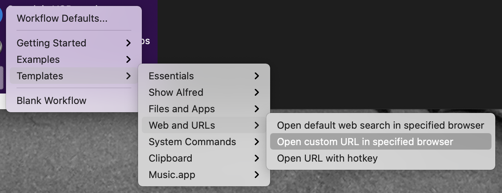

2. 
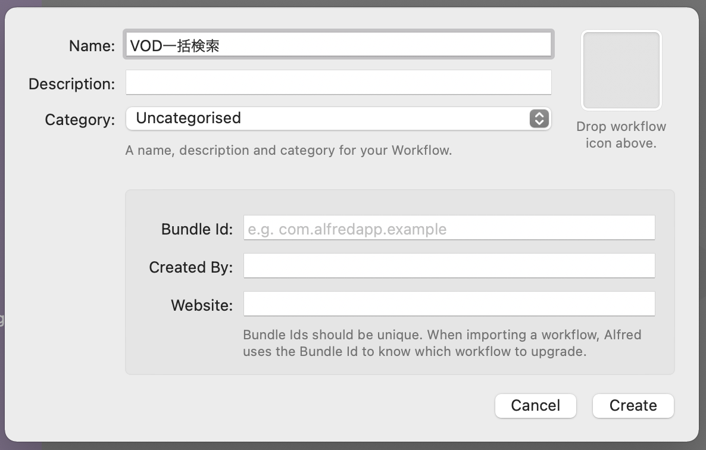

3. 
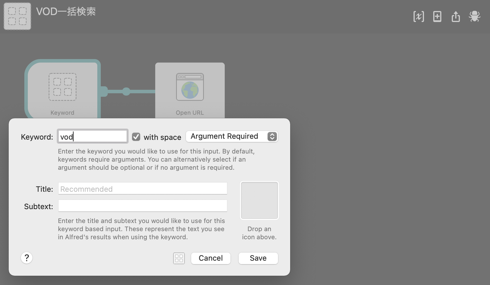

4. 
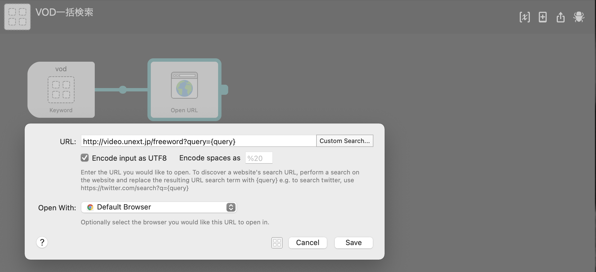

5. 
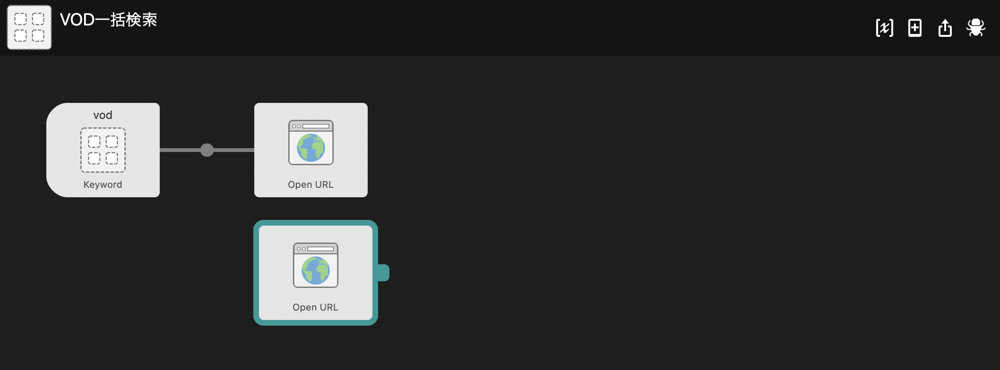

6. 

7. 

8. 

## オススメ設定

### 設定は同期しよう

## 紹介しきれなかった機能
Alfredはまだまだ機能はありますし、愛用している機能はけっこう人によって違うと思われます。僕はほとんど使ってないですが、

あたりは人によってはものすごく重宝するかもしれません。以下の記事が個人的に参考になる&内容があまりかぶってないので、もっと知りたい方はごらんください。
