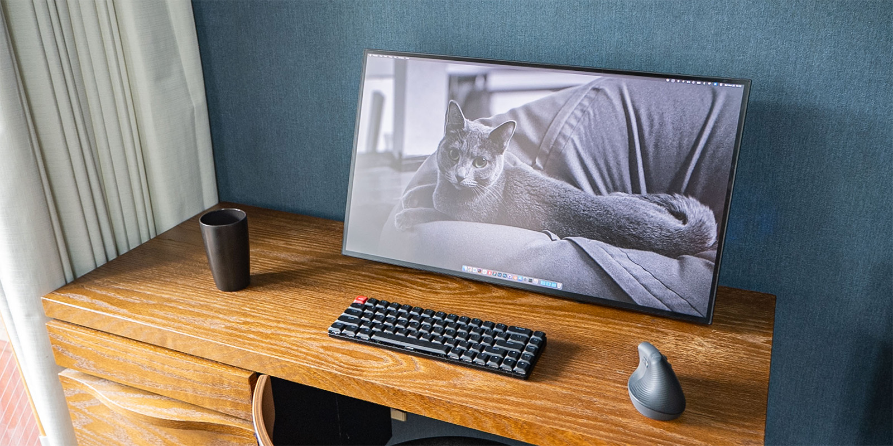
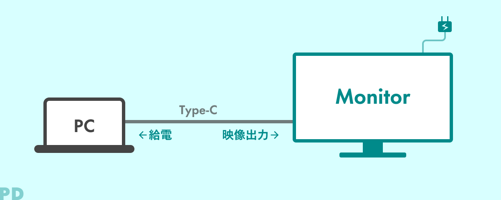
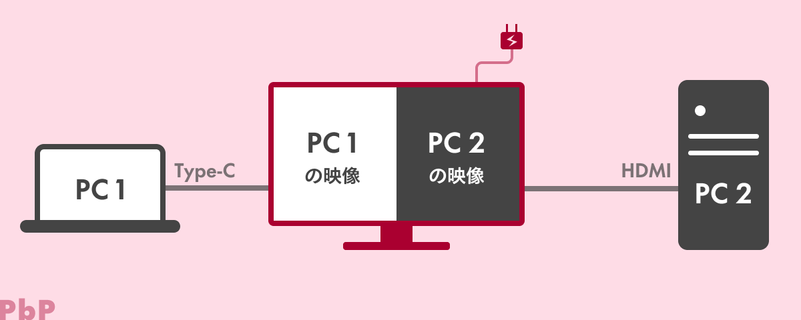
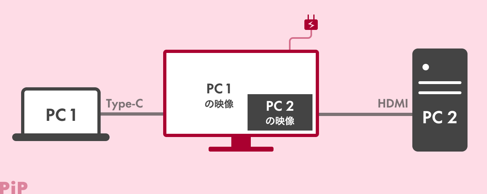
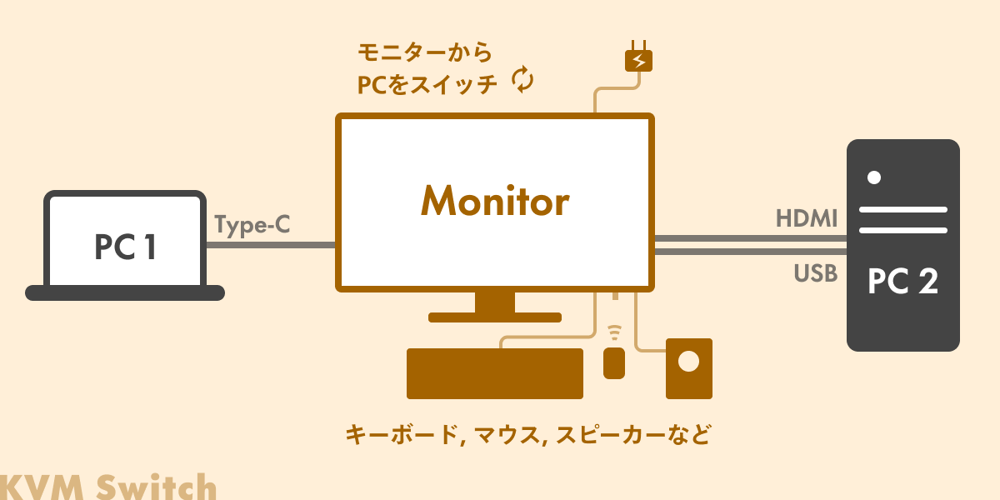
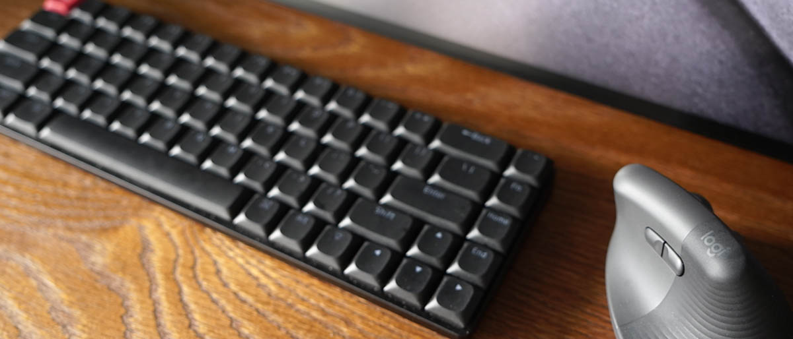
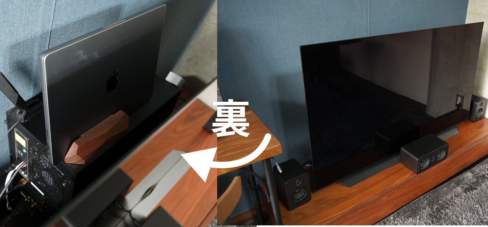
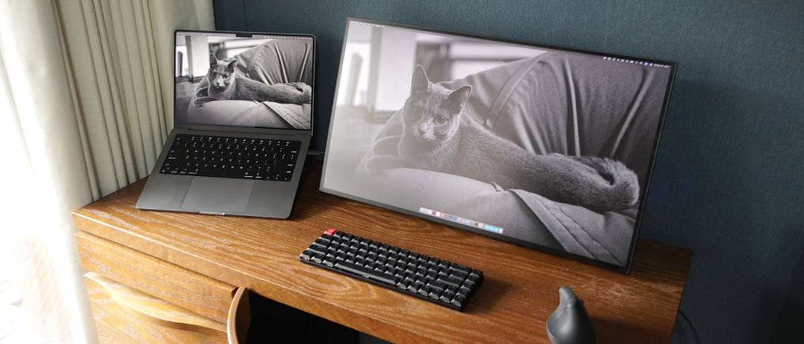
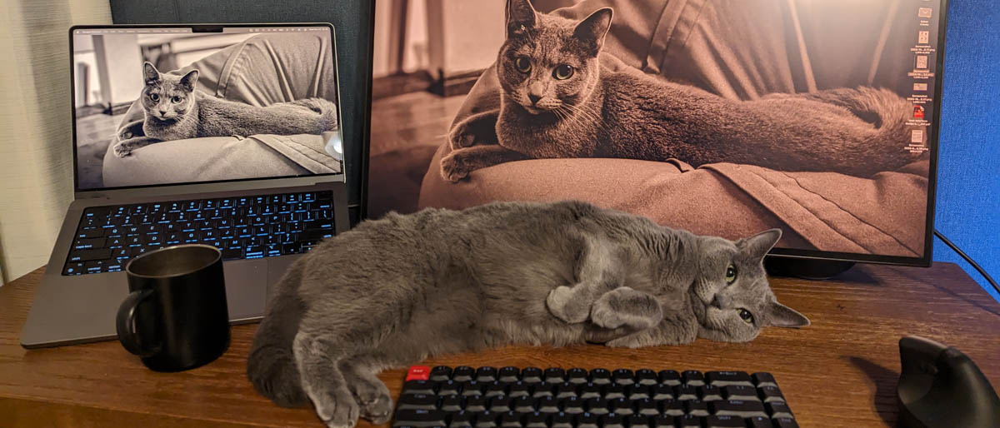

## 背景: 最近モニターを買い替えました

{{}}

5年ほど愛用していた[LG UltraFine 4K](https://www.lg.com/jp/monitors/4k-5k-monitors/24md4kl-b/)モニターにノイズが走るようになってしまったため、社用モニターを新調してもらいました。

以前のモニターはMacに完全最適化されており、それはそれで便利でした。しかし最近は業務の関係上、STBデバイス(Google TVやFire TV)を使ったり、Windows PCをつないだりすることも多いため、複数のデバイスで使用しやすいモニターを選びました。

以下のようなスペックを基準に、見ためが良いモニターを探しました。

- 4K以上
- 16:9で27インチ以下 or 21:9で34インチ以下
- sRGB99%以上 or DCI-P3 96%以上, コントラスト比1000:1
- VESA対応
- 見た目: 背面が黒、3辺以上ベゼルレス

脱線するのであまり詳しくは書きませんが、選ぶのにはかなり時間がかかりました…。

<amp-twitter
    data-tweetid="1719912642717081990"
    width="800"
    height="600"
    layout="responsive"></amp-twitter>

加えて、複数のデバイスで利用するモニターには以下の3機能に対応していると便利です。

1. **PD給電 + USB-HUB機能**
1. **PbP/PiP機能**
1. **KVMスイッチ機能**

### 今回の記事で使用しているPCモニター

いくつか標題の機能に対応している候補はあった(最後に紹介)のですが、最終的に見た目の良さでJAPANNEXTの[JN-27IPSB4FLUHDR-HSP](https://jp.japannext.com/products/jn-27ipsb4fluhdr-hsp)を選択しました。意図せずゲーミングモニターになったのですが、4辺フレームレスで操作も使いやすく気に入っています。



## 1. PD, USB-HUB機能

こちらは最近当たり前になりつつある機能で、知ってる方も多いと思います（ゲーミングモニターでは少ないですが）。ノートパソコンとモニターをType-Cケーブル一本で繋ぐだけで、

* ノートパソコンへの給電
* 映像・音声出力
* モニターをUSBハブとして利用(有線LANやUSBメモリをつなぐ)

ことができます。ケーブルが1本で済むのでデスク上がめちゃくちゃすっきりしますね。

{{}}

本記事では詳細は割愛します。

参考: [ケーブル1本、すっきり接続。EIZO USB Type-Cモニター | EIZO株式会社](https://www.eizo.co.jp/products/eizo_usbtype-c_monitors/index.html)

## 2. PbP/PiP機能

モニターに2つのPCを繋いだとき、それぞれの映像をモニター上に<b>同時に表示</b>できる機能です。

PbP(Picture by Picture)は2つの映像を左右に並べて表示する機能、

{{}}

PiP(Picture in Picture)は片方の映像をもう片方の上に小窓で重ねて表示する機能です。どちらか片方しか対応していないモニターも多いのでご注意を。

{{}}

モニターの機能ではないのですが、ロジクールのマウスの [Logi Flow](https://www.logicool.co.jp/ja-jp/software/logi-options-plus.html) という機能とめちゃくちゃ相性が良いです。

Logi Flow は同じWiFi上のPC間でマウスカーソルを共有する機能で、カーソルを画面の左右端に移動するだけで、スムーズにデバイスを切り替えできます。以下は左にMac, 右にWindowsをPbP表示してLogi Flowを使っている様子です。



参考: [ASCII.jp：自動切り替え＆コピペが本当に便利、ロジクール新型マウスに搭載された“Flow”がヤバい (1/3)](https://ascii.jp/elem/000/001/497/1497389/)

## 3. KVMスイッチ機能

KVMスイッチは本来、マウス、キーボード、スピーカーなどの周辺機器を複数のPCで切り替えて使うためのスイッチ機械です。



この機能が、モニター自体に組み込まれています。モニター側で入力切替すると、**選択したPCに勝手にマウスやキーボードが繋がります**。モニターとの接続は**USBワイヤレスでもOK**です。KVM機能を使うまでは「マウスやキーボードは全部Bluetoothでいいじゃん」と思っていたのですが、有線接続やUSBワイヤレス接続の便利さを感じました。

{{}}

ただしHDMIで繋ぐ場合は図のように別途USBケーブルもつなぐ必要があります。Type-Cケーブルなら1本でOKです。

以下がKVMスイッチを使っている様子です。壁紙が同じなのでわかりづらいですが、モニターからMac→Windowsに入力切替すると、マウスやキーボードがそのまま使えていることがわかります。



## 対応しているおすすめモニター

ちなみに今回、私が最終候補に残したのは以下のモニターです。いずれも見た目が良くて(重要)、PD・KVM・PIPもしくはPBPに対応しています。

<small>※微妙な挙動の差などはあるようなので、ご購入前に公式サイト等でご確認ください。端子の数も必要なものをしっかり確認しましょう。</small>











また、対応したモニターは価格コムで絞り込むこともできます。



## おまけ: その他使用しているデバイスまとめ

写真にうつっているデバイスについてリストアップしておきます。

{{}}

### マウス: [Logi Lift](https://amzn.to/41c0Ii3)

腱鞘炎や巻き肩が気になってきたので購入。めちゃくちゃいいです。公式アプリでかなり細かく挙動をカスタマイズできます。先述の通りPbPとの相性が良いですし、USBワイヤレス対応なのでKVMでも便利。

### キーボード: [Keychrone K7 Pro](https://www.keychron.com/products/keychron-k7-pro-qmk-via-wireless-custom-mechanical-keyboard)

人気のキーボードですね。レイアウトを簡単にに変えられるのでWindows/Mac両方で使いやすいようにカスタムしています。キーキャップの色が嫌だったので[こちらの製品](https://amzn.to/3R9jKkk)に変えているのですが、文字の部分が透明でバックライトが見やすく、気に入ってます。



### PC: MacBook Pro & Windows Desktop

{{}}

TVの裏にがんばって隠してます。ジョブズがキレそうですね。

{{}}

ほんとは↑こういうふうに配置するとめちゃくちゃ使いやすいのですが、

{{}}

猫ポジの問題があるのでやめました。
