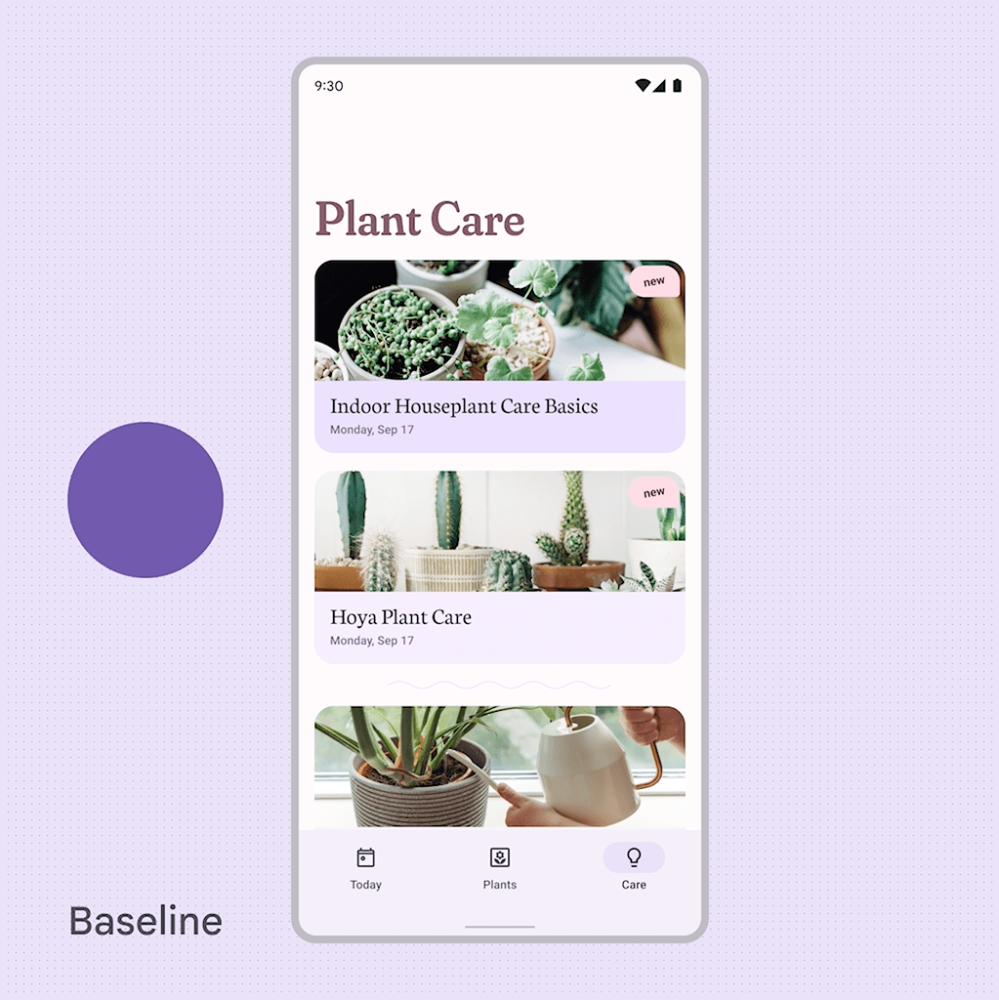
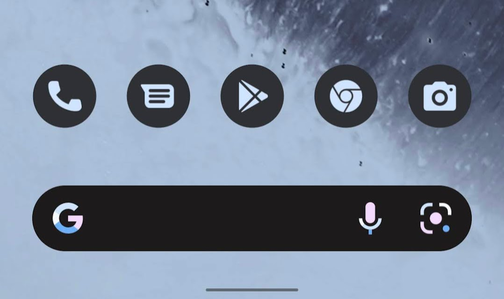
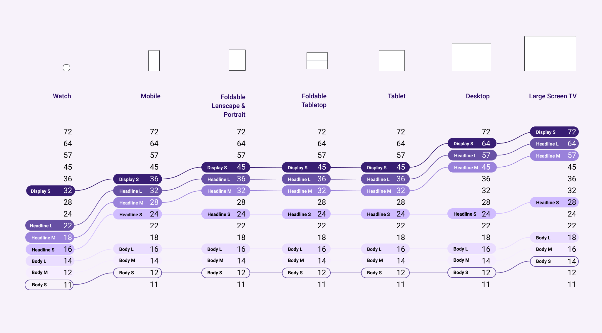
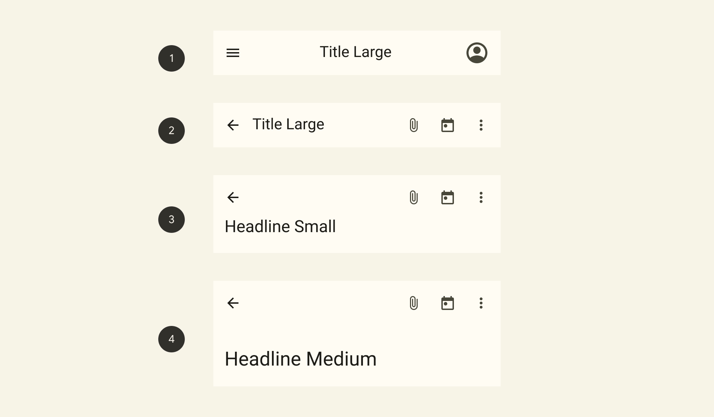

こちらが先日公開された Material Design 3 の公式ページです。



[material.io](https://material.io/) のアップデートではなく、 [m3.material.io](https://m3.material.io/) と別でURLを分けているので、まだ正式版ではなさそうです。また、[Google公式のFigma](https://www.figma.com/@materialdesign)でもMaterial Design 3のUI Kitが公開されています。

## Dynamic Color

{{}}
<small>https://m3.material.io/foundations/customization</small>

ユーザーの壁紙に応じてシステムUIの色を変更する、**Dynamic Color** が定義されました。画像に応じてどのような色が表示されるかは、[公式ツール](https://material-foundation.github.io/material-theme-builder/)を触ってみるとすぐ理解できると思います。

### M3 Color System
この Dynamic Color はシステムUIだけじゃなく、自社アプリ内でも使用できます。M3カラーシステムという構成で色をトークンとして定義することで、デザイン・実装で共通認識を持って色を管理できるようです。Accent, Neutral, Errorなど数パターンで色相を定義し、それぞれが13段階のトーンに分けて使用できます。

FigmaでUIデザインを作成している場合は、公式の[Figma Plugin](https://www.figma.com/community/plugin/1034969338659738588)を使用するとこのM3カラーシステムでデザインを進められそうです。

また、詳しいドキュメントは見つけられなかったのですが、アプリアイコン自体もユーザーのカスタムカラーに応じて動的に変更できるようになりそうです。Pixel+Android12で、一部アイコンはすでに変更可能です。

## Adaptive Design

<amp-video src="./adaptive.mp4" controls width="1247" height="830" layout="responsive"></amp-video>
<small>https://m3.material.io/foundations/adaptive-design/overview</small>

モバイルディスプレイからタブレット・デスクトップ、フォルダブル（折りたたみ）デバイス、さらにそれらの縦横状態などでよりシームレスに利用できるUIデザイン対応が求められます。この背景はChromebook・Windows11でのAndroidアプリ対応や、発売が噂されているPixel Foldなど、Androidがこれからより多くのディスプレイサイズで利用されることが大きそうです。

大画面対応・フォルダブル対応はちょっと量が多いので別で記事にする予定です。

## Interaction states



ユーザーの操作に対するインタラクションに対しても、より丁寧な定義が追加されました。以前から[Surfaces](https://material.io/design/environment/surfaces.html)や各種コンポーネントのページで定義されていましたが、よりトークンに連携した形で説明されており、実装やデザインでの管理がしやすくなっています。

## Typography
タイポグラフィはバリエーションが減ってシンプルになりました。こちらも同様にトークンによる管理が可能になっています。さらに、デバイスサイズに応じて動的にフォントサイズを管理できる<b>Adaptive type scale</b>も利用できるようになりました。

<small>https://m3.material.io/styles/typography/overview</small>

## Component
Floating Action Button や Bottom Navigation などのコンポーネントは全体的にかなりスタイル変更されました。先述の Dynamic Color が採用され、全体的に丸っこいシェイプと淡い配色が多用されています。ドロップシャドウもけっこう減って、UI階層がわかりやすくなってます。全体的にスタイルは大きく変わったのですが、ざっと見た感じルールや用途はあまり変わっていなそうです。(当然っちゃ当然ですが)

あえて言うなら[Top App Bars](https://m3.material.io/components/top-app-bar/overview)の種類が増えて使いやすくなってますね。デバイスの縦長化に伴って上部UIを大きくしたい需要は高いので、ありがたいです。

<small>https://m3.material.io/components/top-app-bar/overview</small>

あいかわらずMaterial DesignのドキュメントはUIの使用ケースやルールが明確でわかりやすいですね。

## まとめと個人的な感想
全体的に

* トークンによる保守管理性の向上
* マルチデバイスへのレスポンシブ対応

が重視されているようですね。Dynamic Colorはキャッチーですが、あくまでオマケかなあという印象です。

Android12, 壁紙から色を変えてくれるのはいいんですが、個人的には自分ですべての色を選んでカスタムしたい...。公式ウィジェットが独特すぎるデザインを主張してくるのもすごく嫌です。
