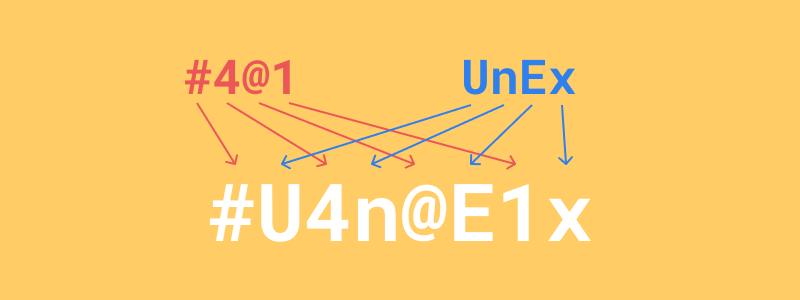

前提として、[LastPass](https://www.lastpass.com/)や[1Password](https://1password.com/jp/)などの<b>パスワード管理アプリ</b>を使っている方にはあまり必要ないです。ただ、それと併用しても利用できるテクニックなので、参考にはなると思います。

## パスワードのセキュリティリスク
まず、Webサービスやアプリのパスワードにはどんなリスクがあるかかんたんに確認します。読み飛ばしてもOKです。

### リスト攻撃
いわゆる「アカウント情報の漏洩」が起きてしまったときにリスクが発生します。攻撃者はあるサイトで漏洩した「アカウントIDとパスワード」のセットを利用して、他のサイトでログインを試みます。複数のサイトで同じID・パスワードの組み合わせを利用している人が被害に遭いやすいです。

これを避けるために、**サービス、アプリごとにパスワードを変える**必要があります。

### ブルートフォース(総当り)攻撃
考えられる文字の組み合わせをすべて試せば、いつかはパスワードはバレてしまいます。もちろん人間が1つずつ試す場合は現実的ではないですが、コンピュータープログラムで自動処理することで、かんたんなパスワードならかなり短い時間で破られてしまいます。

たとえば英語のみの4桁のパスワードであれば約3秒と一瞬で破られます。対して英後の大文字小文字＋数字＋記号を使った8桁のパスワードであれば、破るのに約1,000年かかるそうです。([参考](https://cybersecurity-jp.com/column/17426))

つまり、**英語の大文字小文字、数字、記号などを使った複雑なパスワードにする**必要があります。

### 辞書攻撃
多くの人が`password`や`12345678`、`qwerty`などのかんたんなパスワードを使ってしまっています。これらは一般的に攻撃者に知られており、かんたんにログインを試行されてしまいます。また、辞書にある`banana`や`love`などの単語も総当りで試されることが多いです。

これを避けるために、**よく使われているパスワード、かんたんな単語はパスワードに使わない**必要があります。

### パスワード推測によるアカウントハック
パスワードに誕生日や好きなワードを使ってしまうと、家族や友人に推測されたり、個人情報を調査した攻撃者から推測されてしまうことがあります。知人の場合でも、ちょっとしたいたずら程度で済めばいいですが、子供がクレジットカードをつかって高価な買い物をしたりするリスクが考えられます。

これを避けるために、**誕生日など容易に推測できる情報は使わない**必要があります。

---

以上、かんたんにパスワードにひそむセキュリティリスクをまとめました。もっと詳しく知りたい方は、以下の本など参考になると思います。



つまりざっくりまとめると、**サービスごとに強力なパスワードを使い分ける**必要があるのですが、実際にはそうかんたんに考えてられないですし、すべて覚えることは現実的じゃありません。

## 安全で楽に覚えられるパスワード管理方法
こっから本題です。その方法とは、**登録したいサービスの名前をもとに、自分ルールでパスワードに変換する**ことです。Googleのアカウントなら`google`、Instagramのアカウントなら`instagram`という英語の文字列をもとにしてパスワードを考えます。もちろんそのまま使用するとよわいパスワードですから、単語の変換ルールを自分なりに用意して強力なパスワードを作り出します。

### 自分ルールの例
たとえば、以下のようなルールが考えられます。  
<small>※ もちろん、これはそのまま使わずに、自分なりのルールを考える必要があります。</small>

> 1.  4桁のランダムな数字と記号を組み合わせて用意する。(これはがんばって覚える)
> 2.  サービス名の頭文字4つを取り出して、英語の大文字と小文字に互い違いにする
> 3.  1と2を交互に組合わせて完成

なんだか難しそうですが、実際にやってみればかんたんです。

### 実際にパスワードを作り出す例
では[U-NEXT](https://video.unext.jp/)というサービスにアカウントを登録し、パスワードを考えると仮定しましょう。この場合`unext`という文字列をもとにしてパスワードを考えます。

#### 1. 4桁のランダムな数字と記号を組み合わせて用意する
まず、数字と記号をランダムに組み合わせた4桁のキーワードを用意します。これは使い回すことになるので、がんばって覚えましょう。
{{}}

#### 2.  サービス名の頭文字4つを取り出して、英語の大文字と小文字に互い違いにする
サービス名の最初の4文字を取り出します。それを交互に大文字・小文字にしておきましょう。もしサービス名が短い場合は、繰り返せばいいと思います。(例:[alu](https://alu.jp/)→`alua`)
{{}}

#### 3. 1と2を交互に組合わせて完成
あとはそれぞれの文字列を組み合わせて完成です。
{{}}

### 自分ルールの他の例
自分ルールを複雑にしておくほど、より強力で破られづらいパスワードになります。例えば、以下のような変換ルールが考えられます。自分なりのルールを考えるときに参考にしてみてください。

* サービス名をそのまま使うのではなく、アルファベット1文字ずつずらす
    * U-NEXT → unex → UnEx → `VoFy`
* サービス名で8桁分で文字列を作り、その偶数番目をキーワードで置き換える
    * U-NEXT → unextune + #4@1 → u#e4t@n1e

なお、サービスによって使用できる文字や記号、パスワードの桁数は異なるので、それに対応できるルールだと完璧です。

### 自分ルールを覚える自信がないときは？
ルールやキーワードを忘れそうで不安な場合は、紙に書いてしまって安全な場所で管理するのもいいと思います。なんだか危なそうな印象もありますが、セキュリティの専門家である[徳丸先生も紙に書いて保存すること自体は安全だとおっしゃっています](https://www.motex.co.jp/nomore/column/1036/)。もちろん付箋などに書いて誰でも見れる場所に貼っておくのは論外ですが...。

## まとめ
この手法のメリットは以下です。

* 英数字・記号を組みあせた**強力なパスワード**を作れるので、**辞書・総当り攻撃に強い**
* サービスごとに**違うパスワードを使い分けられる**ので、**リスト攻撃に強い**
* 4桁のフレーズと、自分ルールさえ覚えておけばいいから**楽・かんたん**

読んでいただきありがとうございます。私はセキュリティの専門家ではないので、詳しい方がいたらコメントいただけると助かります。
