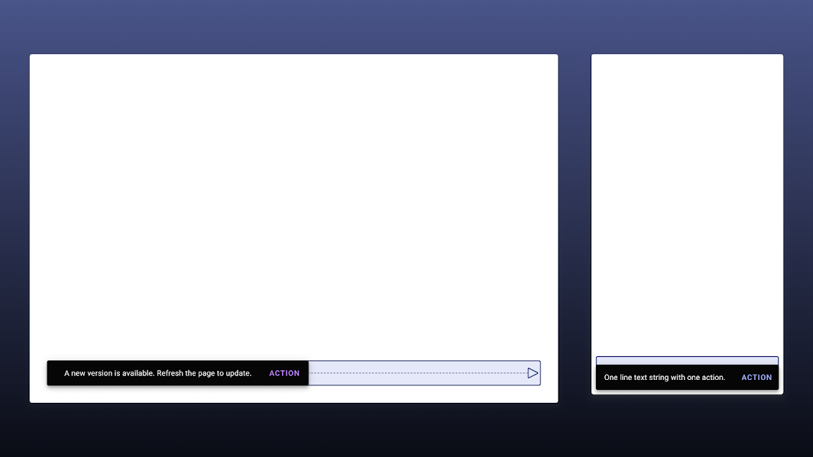

## 背景・前説
Androdi OS はもともと、iOSと違って多くのデバイスで使われることを想定しています。iOSが自社製作のデバイスであるiPhone・iPadでのみ使われるのに対して、AndroidはGoogle以外が作った多くのスマートフォンやタブレットにもインストールされ、様々な環境で使用されますね。

さらに昨今は ****Chromebook (Chrome OS) や Windows11 でAndroidアプリが使えるようになった** ことや、Foldableデバイス(折りたたみスマホ)などの発売など、Androidがこれからますます多くのディスプレイサイズで利用されることが予想されます。

{{}}
<small>Androidが動くデバイスのほんの一例</small>

Material Design でも、マルチデバイス対応・フォルダブル対応が重視され、ガイドラインが多く追加されました。今回は公式で追加された新しいガイドラインを中心に、内容やリンクをまとめます。

関連記事:



### そもそもフォルダブルデバイス（折りたたみスマホ）ってなんなん？
よく名前を聞くようになってきた<b>折りたたみスマホ</b>。柔軟性を持たせられる<b>有機ELディスプレイ</b>により、画面を曲げておりたたむことができるデバイスです（通常のディスプレイ+ヒンジ構成のもあります）。

{{}}

小さい画面、大きい画面、縦2つ画面、横2つ画面など、様々な状態で使用できるので、これひとつだけで相当いろいろなUIの状態を考慮しなければいけません。まさにデザイナー泣かせ。

まだまだとんでもなく高価で、一般的なハイエンドスマホの倍以上するものが多いです。ユーザー数はしばらく増えないと思われるので、フォルダブル対応自体はそこまで気にせずともいい気はします。

Googleが公式に「Pixel Fold」というデバイスを作っているという噂も、出たり消えたりしていますね・・・。

### Android 12L
とはいえ、先に述べたとおりフォルダブルに限らず大型デバイスが増えているのは確かです。Googleは2022年後半にタブレット向けに最適化されたOSである、**Android 12L**を提供することを発表しています。



通知エリアやロック画面の最適化に加え、画面分割機能やタスクバーなどのマルチタスク補助が強化されていますね。挙動はiPad OSにかなり影響を受けているようです。

{{}}
<small>通知・クイック設定の2列表示</small>

{{}}
<small>タスクバーの表示、ドラッグ&ドロップによる画面分割</small>

{{}}
<small>設定画面の分割</small>

## UIデザインの対応
さて、ここからが本番です。これまでに述べたとおり、より大きい画面はもちろん、画面分割などで<b>これまでにないアスペクト比</b>でアプリが使われることも想定しなければなりません。今回、自社アプリで対応した内容や、各公式ガイドラインを中心に、どういった対応ができるかまとめてみます。

### Material Desing が推奨する3つのステップ
大画面化対応するための記事が、Google公式からいくつか公開されています(後述)。それらで特に一貫されて重要視されているのは以下の3つのステップです。

#### Layout Grid / 縦列のグリッド配置を見直す

{{}}

Material Design では [Layout Grid](https://material.io/design/layout/responsive-layout-grid.html) が定義されています。古の Web Design から用いられている概念ですが、列をグリッドとしてルール化しておくと、ブレイクポイント(デバイスの幅)ごとに柔軟に配置を変えやすくなります。

#### Adaptive Composition / 構成要素をスケーリングさせる
ひとつの画面には以下のように構成要素(Composition)が複数あることが多いですね。

* Bottom Navigation などのグローバルメニュー
* Top App Bars などの情報表示領域
* Cards などで構成されるスクロール領域

Material Design では、画面サイズに応じてこれらの全体的な配置を見直すことを推奨しています。

* 大画面に複数の要素を配置する場合は、カードや仕切り線で視覚的にグループが分かるように意識する
* 1行あたりの最大文字数を60文字程度にして、文章の読みやすさを担保する

{{}}

後述する Navigation Rail の採用など、画面サイズに応じて、構成要素の配置や性質を見直しましょう。

関連記事:

* [Foldables – Material Design 3](https://m3.material.io/foundations/adaptive-design/foldables/compositions)
* [Material Design](https://material.io/design/layout/understanding-layout.html)
* [5 Exercises to Prepare Your App for Large Screens - Material Design](https://material.io/blog/5-steps-large-screen-apps)

#### Component Behavior / 要素ごとの対応
Material Design では、ひとつひとつのComponentも画面に応じて柔軟にその挙動を変えます。例えば [Snackbars](https://material.io/components/snackbars) はモバイルデバイスでは画面幅いっぱいに表示されますが、大型スクリーンでは表示する最大幅が定義されています。

{{}}

最近のアップデートで、以下の Component ページでは、大画面向けの定義が追加されています。

[App bars (top)](https://material.io/components/app-bars-top#behavior) / [Bottom navigation](https://material.io/components/bottom-navigation#behavior) / [Buttons](https://material.io/components/buttons#behavior) / [Cards](https://material.io/components/cards#behavior) / [Dialogs](https://material.io/components/dialogs#behavior) / [Image lists](https://material.io/components/image-lists#behavior) / [Lists](https://material.io/components/lists#behavior) / [Menus](https://material.io/components/menus#behavior) / [Navigation drawers](https://material.io/components/navigation-drawer) / [Bottom sheets](https://material.io/components/sheets-bottom#behavior) / [Side sheets](https://material.io/components/sheets-side#behavior) / [Snackbars](https://material.io/components/snackbars#behavior) / [Tabs](https://material.io/components/tabs#behavior) / [Text fields](https://material.io/components/text-fields)

### 頻繁にタップする要素の配置を考える
スマホを片手で使う際に、指が届かない上端に、頻繁に使うタップ要素を置くことは避けるべきですね。また、フォルダブルデバイスでは下部画像の2番がもっともタップしやすい領域とされています。3番は下部ではありますが、非常にタップしづらい領域とされており、FABなどを置くことは推奨されていません。

{{}}
<small class="reference">[参照: Foldables – Material Design 3](https://m3.material.io/foundations/adaptive-design/foldables/overview)</small>

また、重要な要素をあまり下に置いてしまうと、中途半端なアスペクト比ではファーストビューに入らず、隠れてしまう問題もあります。

{{}}

このへんは配置を下から計算するなど、レイアウトロジックに工夫が必要そうです。

### インプットデバイスの考慮
Androidにおけるレスポンシブ対応は、単に様々な画面サイズに対応するだけではありません。先に述べたとおり、Chrombook や Windows でも使用されることを考えると、**マウスやキーボードでアプリを使われる**こともあります。

{{}}

そのため、ホバーやクリック時のインタラクション、Tabキーによる要素の移動やEnterによる実行などに対応していることが理想的です。このへんはMaterial Design関連のライブラリで実装していると自動的に対応済みなことも多いようです。

また、

* 動画アプリであればspaceキーによる再生/一時停止をするなど、キーボードショートカットの検討
* ゲームアプリであればコントローラー入力に対応するか
* スタイラス/タッチペンの利用を想定するか

などの想定も必要かもしれません。

### Table Top Mode 対応


<small class="reference">[参照: Foldables – Material Design 3](https://m3.material.io/foundations/adaptive-design/foldables/overview)</small>

フォルダブルデバイスは画面を横向きに折りたたみ、机に立てて置くができます。その際に上半分でビデオを再生し、下半分にコントロールを表示すると、とても使い勝手が良いです。

主に動画再生時や、ビデオ通話時に想定されるUXですね。フォルダブル専用の対応なので、優先度は低そうです。

### Sliding Pane Layout
設定型画面や、画面一覧→詳細画面に遷移する画面では、一覧と詳細を左右に並べる<b>Sligin Pane Layout</b>の採用を検討してください。

{{}}

iPadでも設定アプリなどで採用されている画面ですね。Android 12Lでも同じく設定画面で採用される予定です。

### サイズ変更時のMotion
画面サイズが変更された際に、追加された要素や削除された要素を適切にアニメーションさせることで、ユーザーがUIの変化を理解しやすくできます。


<small class="reference">[参照: Foldables – Material Design 3](https://m3.material.io/foundations/adaptive-design/foldables/motion)</small>

ただし、頻繁なサイズ変更を想定しなければいけないのはフォルダブルデバイスくらいですし、どうしても優先度は後回しになりそうです。

### Adaptive Type Scale
Material Design 3 から定義されている動的にサイズ変更できるフォントルールです。

{{}}

デザイントークン(Headline, Bodyなどの変数)ごとにサイズルールを定義することで、デザインと実装で共通したルールで動的にサイズを変えられるようです。ただ、Androidのフォントはデバイスごとにプリインフォントが違いますし、文字サイズはsp(Scalable Pixel)で実装されていることが多いしで複雑なので、かなり面倒そうだなあとは思いました。



### モーダルウィンドウにして表示する
特定の画面をモーダルウィンドウで表示することで、モバイルアプリと同じレイアウトを使い回すことができます。例えばU-NEXTアプリでは、作品の詳細画面を細長いモーダルで表示することで、モバイルとほぼ同じレイアウトで使いまわしています。

{{}}

すべての画面には使えませんが、デザイン・実装コスト削減できる小テクです。

### Navigation Rgail の採用
2年前くらいに Material Design に追加された新Componentです。



U-NEXTアプリでは横幅が600dp以上になると、Bottom Navigation の代わりに表示されます。

{{}}

ちなみに実装面での知見は弊社Androidエンジニアがスライドにまとめてくれてます。



### Side Sheet の採用
こちらも Material Desing のComponent です。モバイルアプリでも使えますが、画面を完全に塞がすに追加要素を表示できるので、大画面デバイスとの相性がよいです。



U-NEXTアプリではブックビューワーの目次を、

* モバイルではFull-screen Dialogs
* タブレットではSide Sheets

で表示しています。

{{}}
<small class="reference">[参照: 古代メソポタミア飯～ギルガメシュ叙事詩と最古のレシピ ©遠藤雅司,大和書房](https://video.unext.jp/book/title/BSD0000420559/BID0000708428)</small>

### ヒンジを避ける
フォルダブルデバイスの展開された画面では、中央のヒンジ周辺48dpに、タップ可能要素を置くことは避けましょう。

{{}}

よくあるNG例としては、Modal Dialogを中央ヒンジに重ねてにそのまま表示してしまうことです。

### 指の移動を小さくする
大画面では指の移動が大きくなってしまうことを意識しなければいけません。ユーザーが操作したUI要素の近くにポップアップを表示することで、ユーザーが効率よく操作を行えます。


<small class="reference">[参照: Samsung Developers](https://developer.samsung.com/one-ui/foldable-and-largescreen/intro.html)</small>

## ケーススタディ
以下のサイトでGoogleがフォルダブル・大画面対応アプリの例をまとめています。非常に参考になるのでぜひ一度ご覧ください。



## まとめ
さいごに、フォルダブル・レスポンシブ関連について、見つけられた範囲で公式情報をまとめておきます。

* [Responsive layout grid - Material Design](https://material.io/design/layout/responsive-layout-grid.html#columns-gutters-and-margins)
* [Adaptive design – Material Design 3](https://m3.material.io/foundations/adaptive-design/overview)

↑Material Design のversion2と3それぞれの関連しそうな項目。このへんを遵守すればひととおり大丈夫なはず。

* [Introducing Material Design Guidance for Large Screens - Material Design](https://material.io/blog/material-design-for-large-screens)
* [Start Here: 5 Exercises to Prepare Your App for Large Screens - Material Design](https://material.io/blog/5-steps-large-screen-apps)

↑ガイドラインというかブログ記事。ざっくり概要を知るには良い

* [Design an Adaptive Layout with Material Design – Figma](https://www.figma.com/community/file/976547042961041487)

↑Google公式の Tutorial Figma ファイルです。

* [折りたたみ式端末に対応したアプリの作成  |  Android デベロッパー  |  Android Developers](https://developer.android.com/guide/topics/ui/foldables)
* [大画面のスタートガイド  |  Android デベロッパー  |  Android Developers](https://developer.android.com/guide/topics/ui/responsive-layout-overview#case_studies)

↑開発者向けガイドラインですが、あるべき挙動について触れられているのでさらっと目を通すといいかも。

* [IntroductionLarge screen UI | Samsung Developers](https://developer.samsung.com/one-ui/foldable-and-largescreen/intro.html)
* [デュアルスクリーンおよび折りたたみ型デバイス向けのアプリを作成する - Dual-screen | Microsoft Docs](https://docs.microsoft.com/ja-jp/dual-screen/)

↑折りたたみスマホを開発している Samusung, Microsoft らもデザインガイドラインを公開しています。

## おまけ
U-NEXTは電子書籍も読めるサービスなのですが、せっかくフォルダブルデバイスで本を読むのに、これ↓はちょっと悲しいですよね。

{{}}
<small class="reference">[参照: 弱虫ペダル　SPARE BIKE ©渡辺航,秋田書店](https://video.unext.jp/book/title/BSD0000104373/BID0000323211)</small>

なので、見開きで現実の本のように読めるようにこっそり改修しています。

<amp-twitter
    data-tweetid="1458268803549175809"
    width="800"
    height="600"
    layout="responsive"></amp-twitter>
<small class="reference">[参照: 名探偵コナン ©青山剛昌,小学館](https://video.unext.jp/book/title/BSD0000036696/BID0000812653)</small>
