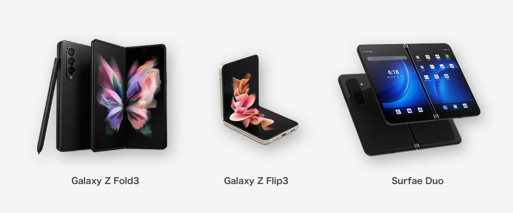

自社アプリでフォルダブル(折りたたみスマホ)対応をしたので、最新のAndroidマルチデバイス・レスポンシブ対応についてUIデザインの観点からまとめてみます。ちょっと長いんで、目次から気になる部分だけでも読んでってください。

## 背景・前説
Androdi OS はもともと、iOSと違って多くのデバイスで使われることを想定しています。iOSが自社製作のデバイスであるiPhone・iPadでのみ使われるのに対して、AndroidはGoogle以外が作った多くのスマートフォンやタブレットにもインストールされ、様々な環境で使用されますね。

さらに昨今は Chromebook (Chrome OS) や Windows11 でAndroidアプリが使えるようになったことや、Foldableデバイス(折りたたみスマホ)などの発売など、Androidがこれからますます多くのディスプレイサイズで利用されることが予想されます。

{{}}
<small>Androidが動くデバイスのほんの一例</small>

Material Design でも、マルチデバイス対応・フォルダブル対応が重視され、ガイドラインが多く追加されました。今回は公式で追加された新しいガイドラインを中心に、内容やリンクをまとめます。

### フォルダブルデバイス（折りたたみスマホ）ってどんなん？
よく名前を聞くようになってきた<b>折りたたみスマホ</b>。柔軟性を持たせられる<b>有機ELディスプレイ</b>により、画面を曲げておりたたむことができるデバイスです（ヒンジがついてるものもあります）。

{{}}

小さい画面、大きい画面、縦2つ画面、横2つ画面など、様々な状態で使用できるので、これひとつだけで相当いろいろなUIの状態を考慮しなければいけません。まさにデザイナー泣かせ。

まだまだとんでもなく高価で、一般的なハイエンドスマホの倍以上するものが多いです。ユーザー数はしばらく増えないと思われるので、これ自体にはそこまで真面目に対応せずともいい気はします。

### Android 12L
とはいえ、先に述べたとおりフォルダブルに限らず大型デバイスが増えているのは確かです。Googleは2022年にタブレット向けに最適化されたOSである、**Android 12L**を提供することを発表しています。



通知エリアやロック画面の最適化に加え、画面分割機能やタスクバーなどのマルチタスク補助が強化されていますね。

## UIデザインの対応
さて、ここからが本番です。これまでに述べたとおり、より大きい画面はもちろん、画面分割などで<b>これまでにないアスペクト比</b>でアプリが使われることも想定しなければなりません。
今回、自社アプリで対応した内容を中心に、どういった対応ができるかまとめてみます。

### モバイルサイズでは上部にあまりタップUIを置かない
これは今回に限ったことではないですが、
ただし、重要な要素をあまり下に置いてしまうと、中途半端なアスペクト比ではファーストビューに入らず、隠れてしまう問題もあります。
このへんは配置を下から計算するなどの工夫が必要そうです。

### キーボードフォーカスやマウスホバーの考慮
### Snack Bars などに最大幅を定義
### Responsive Grid の対応
### Table Top Mode・Sliding Pane Layout 対応
これは主にフォルダブル用の対応なので、優先度は低いかもしれません。

### モーダルウィンドウにして表示する
デザイン・実装コスト削減の小テクです。
### Navigation Rail の採用
### Side Sheet の採用

## まとめ

さいごに、フォルダブル・レスポンシブ関連について、見つけられた範囲で公式情報をまとめておきます。

* [Responsive layout grid - Material Design](https://material.io/design/layout/responsive-layout-grid.html#columns-gutters-and-margins)
* [Adaptive design – Material Design 3](https://m3.material.io/foundations/adaptive-design/overview)

↑Material Design のversion2と3それぞれの関連しそうな項目。このへんを遵守すればひととおり大丈夫なはず。

* [Introducing Material Design Guidance for Large Screens - Material Design](https://material.io/blog/material-design-for-large-screens)
* [Start Here: 5 Exercises to Prepare Your App for Large Screens - Material Design](https://material.io/blog/5-steps-large-screen-apps)

↑ガイドラインというかブログ記事。ざっくり概要を知るには良い

* [折りたたみ式端末に対応したアプリの作成  |  Android デベロッパー  |  Android Developers](https://developer.android.com/guide/topics/ui/foldables)
* [大画面のスタートガイド  |  Android デベロッパー  |  Android Developers](https://developer.android.com/guide/topics/ui/responsive-layout-overview#case_studies)

↑開発者向けガイドラインですが、あるべき挙動について触れられているのでさらっと目を通すといいかも。

### おまけ
U-NEXTでは漫画を
