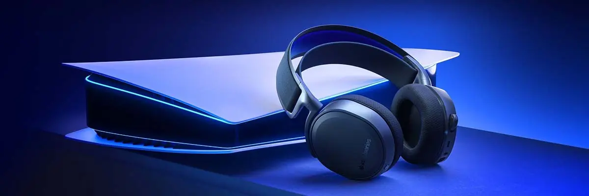

## とりあえず結論

お金があるなら SONYの [INZONE H7](https://amzn.to/3dDCnwH) かCORSAIRの [HS70 Bluetooth](https://amzn.to/3T7bO3j)、あまり無いならHORIの [ゲーミングヘッドセット](https://amzn.to/3dHjtFl) か [イヤフォン](https://amzn.to/3QP14o4) を買っとけばだいたい大丈夫。

## Switch はボイスチャットが不便

昨年からスプラトゥーンにハマり、知人とオンライン通話しながらゲームすることが増えました。LINE、Discord、Nitendo公式アプリなどを使い、スマホもしくはPCで通話を行うのですが、スピーカーを使うと通話マイクにゲームの雑音がまざってしまいます。

{{}}

かといってイヤフォンを使うと、もう片方の音声がよく聞こえません。

{{}}

### PlayStationの場合は公式機能で問題なし

ちなみプレステであればこういった悩みはありません。プレステ自体にオンライン通話機能があるのでスマホ通話は不要です。コントローラーにイヤフォンを刺すだけで、ゲームの音声を聞きながらそのままプレステ上でボイスチャットできます。

{{}}

Switchも本体アップデートでボイスチャット機能が使えるようになるといいですね・・・。

### Switchはゲーム音とボイスチャットの通話音を同時に聴くための環境が必要

とにかくSwitchでゲームしながら通話する際に、なんとかしてゲームと通話の音をいい感じに聞いて、こちらの声もマイクで雑音なく拾ってほしいです。現状、案としては以下のような方針が考えられると思います。

## 案1: ミキサーの利用

{{}}

一番安価に実現できる定番の方法です。ゲームとボイスチャットの音声をひとつにまとめられる、**ミキサー**というデバイスを使用します。以下のように、イヤフォン、Switch(SwitchをつないだTVでもOK)、スマホをミキサーに繋ぐだけです。

{{}}

色々種類がありますが、私はHORIから発売されているイヤフォンにセットでついてきたミキサーを使用しています。こちらはNintendoライセンス商品ですのでデザインもいいですし、あたらしくイヤフォンも買いたい場合は最適です。



なんとスプラトゥーン3モデルも発売予定です



イヤフォンが必要ない場合は、エレコムから2千円程度で[ミキサーのみ販売](https://amzn.to/3pBwFOG)しています。

ただし、最近のスマホはそもそもイヤフォンジャックがついていないので、変換ケーブルが必要な場合が多いのでご注意を。

- [iPhone（Lightning）用](https://www.apple.com/jp/shop/product/MMX62J/A/)
- [Android（Type-C）用](https://amzn.to/3QFB5Q9)

また、Switch(テレビ)とミキサーをつなぐのに[オーディオケーブル](https://amzn.to/3wkNzF6)は必要です。別途必要な長さのものを購入しましょう。

### メリット

かなり安い。すでに持っている有線イヤフォンを使うことができます。

### デメリット

配線はまあまあ煩雑です。特に携帯モードでプレイしている場合はコードがかなり邪魔になりますし、テレビモードの場合でも毎回通話のたびにミキサーをテレビとスマホにつなぐ必要があります。

## 案2: 骨伝導タイプなど、周りの音が聞こえるイヤフォンを使う

{{}}

最近は装着したまま周りの音が聞こえるオープンイヤー型イヤフォンが増えています。骨伝導や指向性スピーカーの技術により耳の穴を塞がないため、つけたままでも周辺の音が聞こえます。マイクも付いていることが多いので、これをスマホの通話に利用し、ゲームの音はそのままスピーカーで聞くことができます。

{{}}

以下のようなイヤフォンが向いています。

- [ambie sound earcuffs](https://amzn.to/3pmzuDi):
イヤーカフ型のオープンイヤーイヤフォンです。見た目がカッコよく、かなり長時間つけていても耳がいたくなりません。通話品質はそんなによくないです。
- [Anker Soundcore Frames](https://amzn.to/3SQTw6c): メガネ型のイヤフォンです。Huaweiなどいくつかのメーカーから同様の製品が出ています。
- [SHOKZ OPENMOVE](https://amzn.to/3K40zEM): 骨伝導型では一番定番のイヤフォンメーカーです。[いくつかグレードがあります](https://jp.shokz.com/collections/all-products)。探せば似たような安い中華製品もあります。

私はambieとSHOKZ(旧モデル)を持っていますが、どちらも快適にプレイ&通話できました。私は試したことがないのですが、AirPodsなどの外音取り込みでも似たようなことはできるそうです([参考](https://twitter.com/tkackey/status/1539201509912502273?s=21&t=PLk9MzV6fv2XhtoP9e35Hg))。

### メリット

すでにオープンイヤー系のイヤフォンを持っている方は、とりあえずの良い選択肢になると思います。配線もすっきりしますしかなり楽です。

### デメリット

イヤフォンによっては多少マイクがゲーム音を拾ってしまうので、通話の品質は良くないかもです。音の聞こえ方が慣れるまで気持ち悪いというのもあります。

## 案3: キャプチャボードを使いゲームも通話もすべてPC上で行う（PC限定）

{{}}

動画配信者やプロゲーマーの方はこの方式を取っている方が多いかと思います。Switchの音声と映像をPC側に出力し、PCのモニター上でゲームをプレイします。そのまま同じPCでLINEやDiscordによる通話ができるので、イヤフォンはPCにつなぐだけでOKです。

{{}}

私は[ShadowCast](https://amzn.to/3BW1ogI)という小型・安価なものを持っているので試してみましたが、遅延がかなり気になったのであきらめました。

安価に抑える折衷案として、ゲーム映像はテレビのままで、音声のみPCに出力する方法もあります。ただし、PC側にAudio-in(ゲーム音入力用)とAudio-out(イヤフォン繋ぐ用)の2つの端子が必要になるので、実質デスクトップPCじゃないと厳しいです。もしくはUSB変換器やHDMIのスプリッタを使うなどいくつかは方法はありますが、複雑になりすぎるので割愛します。

### メリット

ゲームのプレイ、通話、録画等がPCひとつで完結するのでいちど配線を完了してしまえば楽です。この環境を揃えればそのままゲーム実況や動画配信も行えます。

### デメリット

キャプチャボードだけで2万前後しますし、遅延なく快適な環境を実現するにはハイスペックなゲーミングPCが必要な場合が多いです。お金だけでなく、揃えるのにそこそこの知識も必要になります。またスマホでは当然この環境は実現できません。

## 案4: デュアルワイヤレスかつミキシング対応のBluetoothイヤフォンを使う

{{}}

個人的にかなりおすすめの方法です。2.4Ghz方式とBluetooth方式でSwitchとスマホに接続でき、なおかつそれらの音を **同時に聴ける(ミキシングできる)** イヤフォンを利用します。以下の様にSwitchには2.4Ghz用のドングル(通信機)を利用して遅延無しで接続し、スマホにはBluetoothで接続します。

{{}}

### 前提知識: FPSに使えるレベルの無線イヤフォンについて

無線イヤフォンでFPSや音ゲーをする場合、遅延を気にする必要があります。無線イヤフォンの通信方式にはざっくり**2.4Ghz WiFi** と **Bluetooth** があり、Bluetoothはさらに何種類かのコーデックに分かれています。

| 形式 | 遅延速度 |
| --- | --- |
| 2.4Ghz WiFi | 16ms |
| aptX LL | 40ms |
| aptX Adaptive | 50~80ms |
| aptX | 70ms |
| AAC | 120ms |
| SBC, LDAC | 200ms~ |

参考: 
* [Bluetooth vs. USB Wireless | SteelSeries](https://steelseries.com/blog/bluetooth-vs-usb-wireless-120)
* [「GO blu」と「BT-W4」を使って夢のワイヤレスゲーミング環境を構築！](https://news.denfaminicogamer.jp/kikakuthetower/220617c)

人間が知覚できる遅延速度が25msまでらしいので、理論上2.4Ghz WiFiであればいっさい**遅延を感じない**ことになります。FPSゲームに使うのであれば、最低でも遅延100ms以下のものを選ぶのが良さそうです。

以下、おすすめのイヤフォンです。※価格は記事執筆時のものです。

#### 1. SteelSeries ARCTIS 9 WIRELESS
{{}}
- [Amazon](https://amzn.to/3vUPUWW)
- [公式サイト](https://jp.steelseries.com/gaming-headsets/arctis-9)

ゲーミングブランドのSteelSeriesから出ているヘッドセットです。このジャンルの先駆け的な存在であり、重めですが評判は良いです。

重量: 367g, バッテリー: 最大20時間, 価格: 2.2万

#### 2. INZONE H7
{{}}
- [Amazon](https://amzn.to/3A0165K)
- [公式サイト](https://www.sony.jp/inzone/products/INZONE_H7/)

Sonyから発表されたゲーミングヘッドセットです。当然PS5向けではあるのですが、ミキシング対応なので、Switchにもバッチリです。私はこれを買いましたがかなり快適です。ノイキャン付きの上位モデルH9もあります。

重量: 325g, バッテリー: 最大40時間, 価格: 2.8万

#### 3. CORSAIR HS70 Bluetooth
{{}}
- [Amazon](https://amzn.to/3wgYEHd)
- [公式サイト](https://www.corsair.com/kr/ja/カテゴリー/製品/ゲーミングヘッドセット/ステレオ-ヘッドセット/HS70-BLUETOOTH-Multi-Platform-Gaming-Headset/p/CA-9011227-AP)

こちらは2.4GhzWi-Fiには対応していないのですが、有線接続とBluetoothをミキシング再生できます。なのでスマホにはBluetooth、Switchには有線で繋ぐことで他の製品と同様にミキシング再生で利用可能です。

有線になってしまうのですが、そのかわり **価格がかなり安いですし、テレビに挿せばPS5との併用もラクかも** しれません。かなりオススメです。

重量: 352g, バッテリー: 最大30時間, 価格: 1.3万

<small>※ 同じメーカーから最近 [2.4Ghz対応のモデル](https://amzn.to/3QT327c) も発売されたのですが、こちらはSwitchに対応していないそうです([参考](https://kakakumag.com/game/?id=17886))。</small>

#### 4. GENKI: Waveform Earphones
{{}}

こちらも2.4Ghz WiFi接続ではないですが、良さそうなのでリンクだけ紹介しておきます。ゲーム側との接続は Bluetooth aptX Adaptive方式です。クラファン中の商品ですのでご注意。

- [公式サイト](https://www.kickstarter.com/projects/humanthings/genki-waveform)

### 注意: デュアルワイヤレス対応をうたっていても同時再生できない機器もあります！

2.4GhzとBluetoothで接続できるが、あくまでも**切り替えできるだけであり同時に音声を聴くことはできない**商品もけっこうあります。Quantum TWS、RAZER Barracudaなどは商品説明に「プレイ中の電話にもすぐ応答でき、その後ゲーム音声にシームレスに切り替え」といった説明があることから、あくまでも切替式であることが伺えます。正直わかりづらいので、ちゃんと同時再生できるのかレビュー記事などで確認してから買いましょう。

### メリット

配線がめちゃくちゃすっきりします。雑音が心配がないので、通話の品質も良いです。

### デメリット

わりと高価です。また有線イヤフォンと比較すると充電の手間があります。PS5と共通でイヤフォンを使う場合はWiFiドングルの接続先を変える手間があります。

## まとめ

それぞれの案のメリデメをざっくり表にまとめときます。

|  | 通話デバイス | Switch Lite   ・携帯モード | 価格目安 | PS5併用 | 音声品質
| --- | --- | --- | --- | --- | --- |
| 案1: ミキサー使用 | スマホ / PC | △ | 4千〜 | △ | ◯ |
| 案2: オープンイヤー型 | スマホ / PC | ◯ | 1万〜 | ◯ | △ |
| 案3: キャプチャボード | PC | ✗ | 5万〜 | ◯ | ◯ |
| 案4: デュアルワイヤレス | スマホ / PC | △ | 2万〜 | △ | ◯ |

### 補足

スプラトゥーン3 いっしょにやってくれるデザイナー・エンジニア募集中です↓


