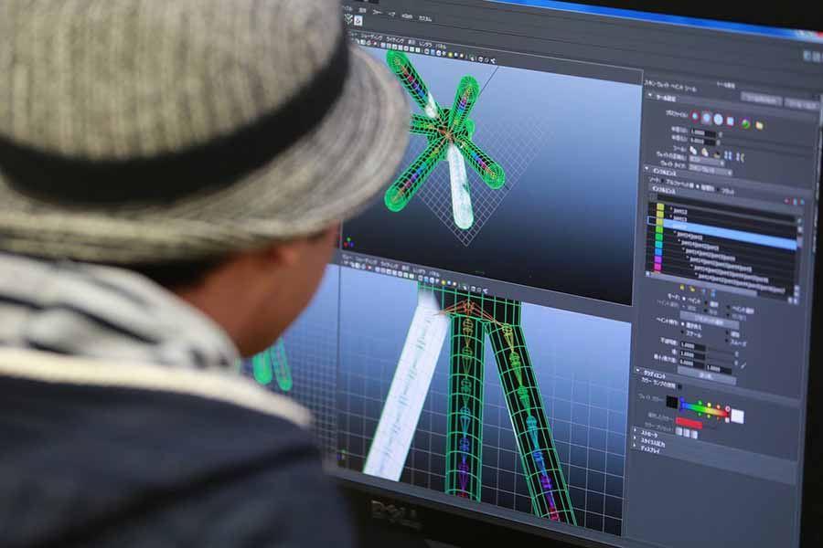

## 企画・構成
6人チームにより本の内容を企画し、制作しました。私は主に内容のアイディア、本の装丁、内容のデザインを担当しました。またそれぞれがモンスターのモデリング、文章を分担して担当しました。

## モデリング
学習も目的の一環であったため、新しい技術に挑戦するためMayaとZbrushによるモデリングに挑戦しました。

## 成果物
1冊の本の形に印刷し、大学内で各所に配布しました。販売はしておりませんが、以下からPDFをダウンロードできます。

[第四種特殊生物報告書.pdf](第四種特殊生物報告書.pdf)
