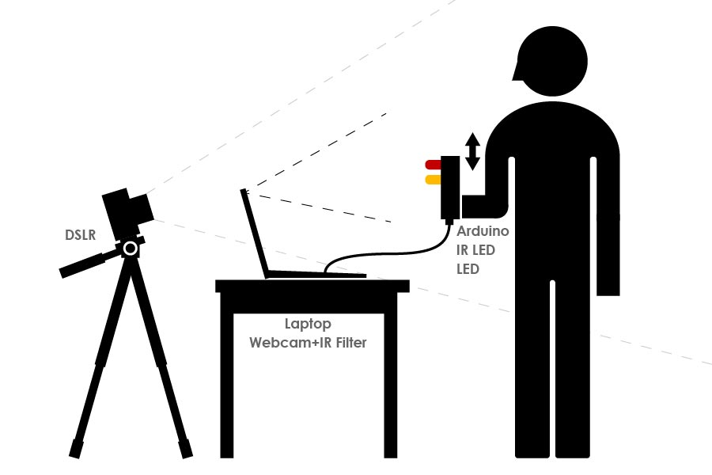
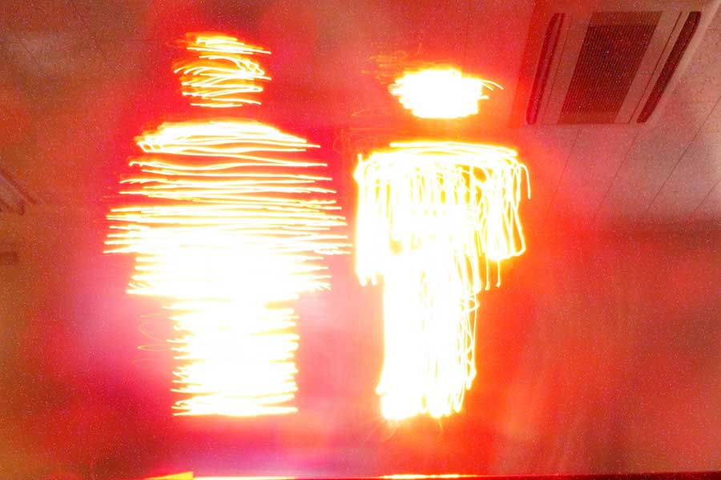

筑波大学大学院にて、落合陽一 氏の授業にて3人チームで企画・作成。

## 仕組み
**人間の力をデジタルに使わせてアートする**というコンセプト。ArduinoやIR LED、一眼レフ、PC、IRフィルターなどで構成され、ソフトウェアはProcessingにより開発。デバイスを振ると、あらかじめ設定した画像の領域に入ったときにライトが光り、スローシャッター撮影によりアート作品が生まれる。

## 作例
透過PNGを読み込ませることで自由な画像をライトアートに変換できる。

## 担当範囲
* 企画・アイディア
* Processingによるシステム作成
* 論文執筆の一部
