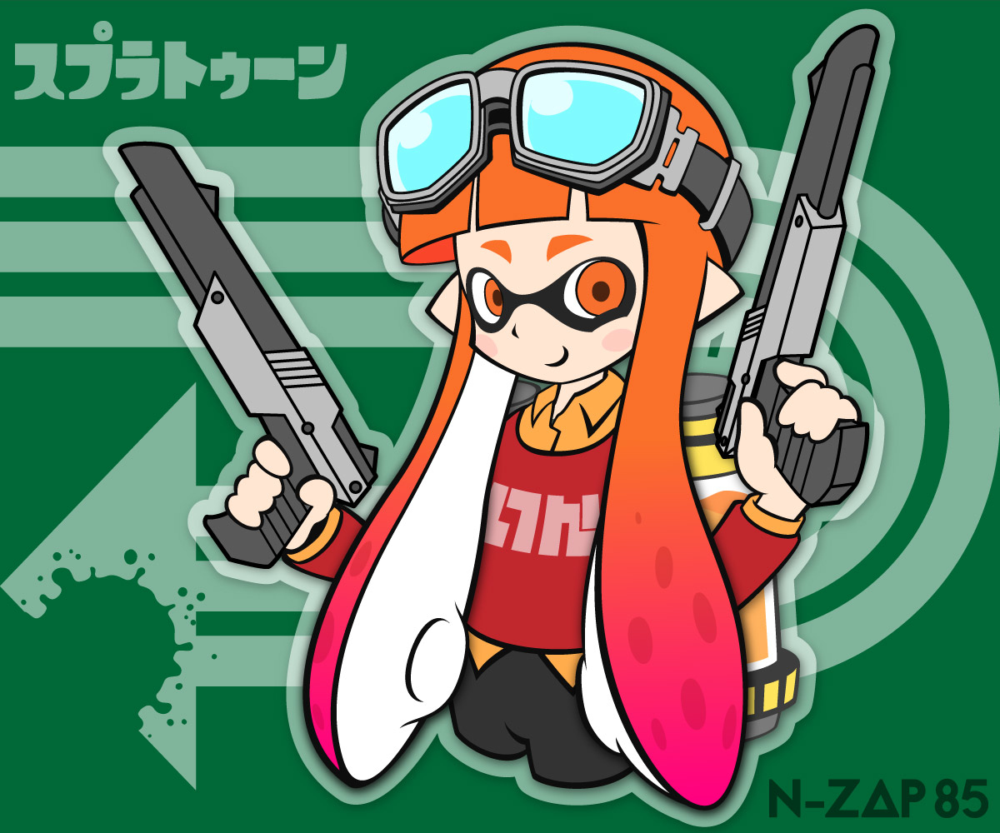

## Microsoft 開発支援キャラ
マイクロソフトが開催した開発者支援 [マスコット キャラクター コンテンスト](https://docs.microsoft.com/ja-jp/previous-versions/msdn10/mt603996(v=msdn.10))に応募した作品です。スマートな印象をあたえるためにキリンをモチーフに、ロゴを使ってデザインしました。優秀賞を受賞しました。

