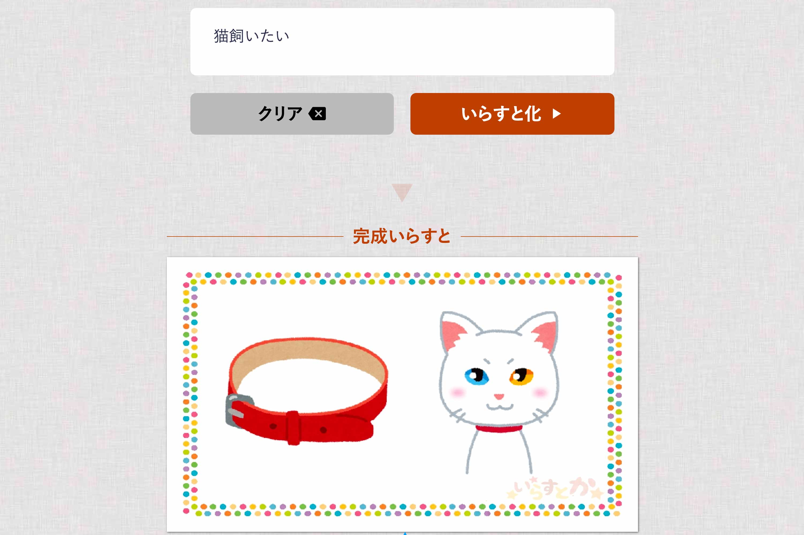

入力した文章をいらすとに変換するWebアプリです。文字列を形態素解析し、Wikipediaのキーワードと連携してそれらしい1枚の画像に仕上げます。

[GAGAZIN](http://gigazine.net/news/20170206-irasutoya-irasutoka/)、[livedoorNEWS](http://news.livedoor.com/article/detail/12638328/)、[APPBANK](http://www.appbank.net/2017/02/06/iphone-news/1308841.php)、[BuzzFeeD](https://www.buzzfeed.com/akikochino/irasutoka?utm_term=.qsVLx58j8#.hqond64G4)、[ねとらぼ](https://nlab.itmedia.co.jp/nl/articles/1702/07/news092.html)、[やじうまWatch](https://internet.watch.impress.co.jp/docs/yajiuma/1042606.html)など、多くのメディアに掲載していただきました。

5人チームで参加し、ヒラタは企画・デザイン・フロントエンドを担当しました。とにかく「楽しい」サービスであることを目指し、アクセス後すぐ利用できる迷わない構成でデザインしました。

