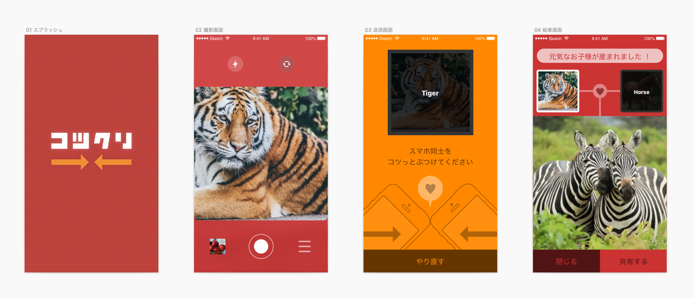

例えば、「椅子」と「机」の画像から、「部屋」の画像を返すなど。Microsoft Computer Vision APIで入力画像を認識してラベル付けを行い、そのラベルからword2vecで概念的な子供としての単語を生成、その単語からMicrosoft Bing Search APIを用いて画像を返している。

友人と参加し、アイディア出しと、アプリデザインやプレゼン資料など全体的なデザイン作業を行いました。SketchとSympliを用いてエンジニアと効率的に作業の連携を取りました。
