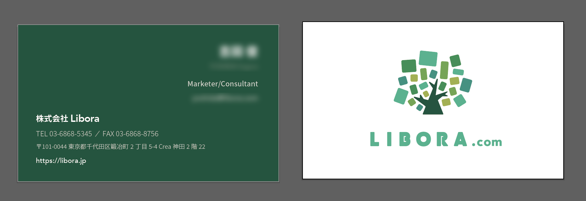

株式会社Libora様の起ち上げにあたって、デザイナーとしてお声がけいただきました。会社のロゴ・名刺やブランディングディレクションなどに加えて、コーポレートサイトのコーディング、サービスUIデザインのお手伝いなどで関わらせていただきました。

コーポレートサイトはJAMStackと呼ばれるモダンフロントエンドの構成で実装し、ContetnfulというCMSで簡単に更新できるサイトを作成しました。
