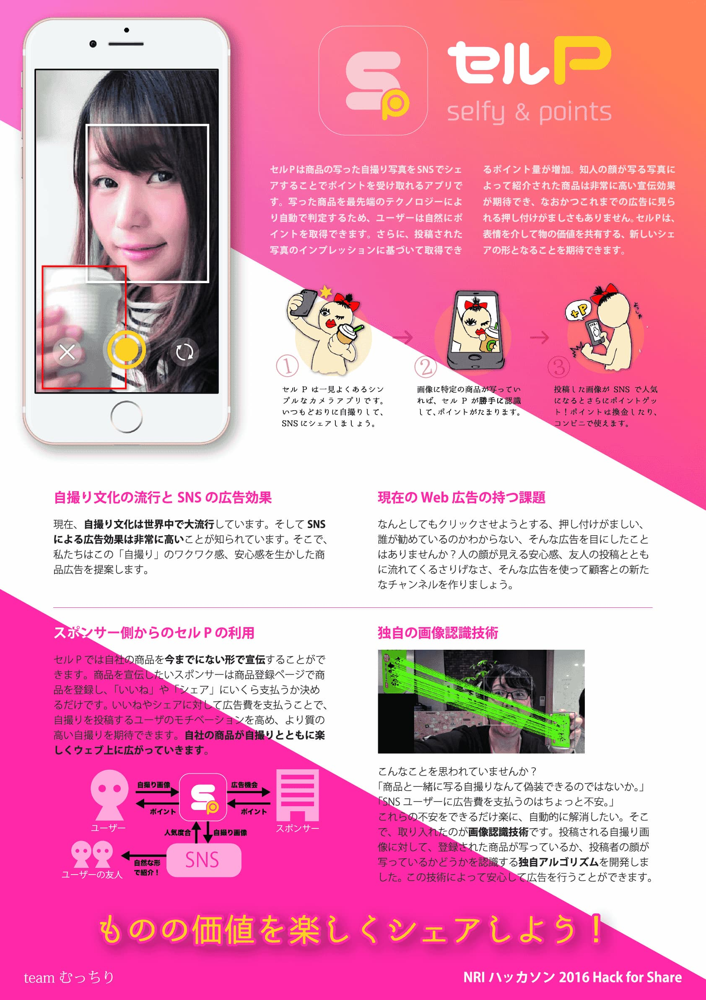

商品のセルフィー + ポイント還元がコンセプトのアプリ。企業は「知人の自撮り」という高い広告効果に対して、広告費を支払うことができる。

## プロモーションビデオ

    <iframe width="560" height="315" src="https://www.youtube.com/embed/uisASoDBFqg" frameborder="0" allow="accelerometer; autoplay; clipboard-write; encrypted-media; gyroscope; picture-in-picture" allowfullscreen></iframe>

## ポスター

