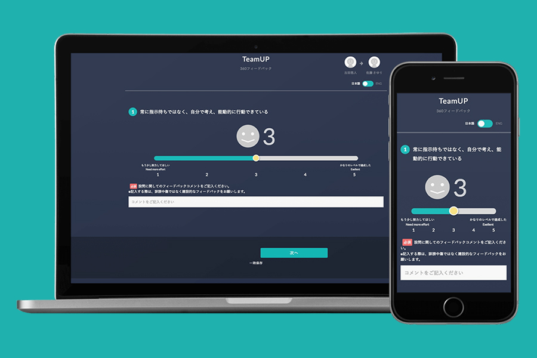
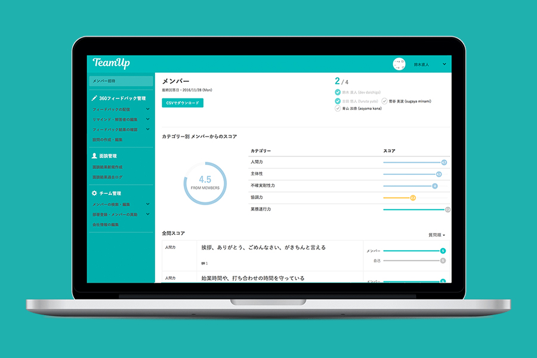

[teamup株式会社](https://www.teamup.jp/corporate)による、B向けWebサービス。企画段階から関わり、イニシャルメンバーとして5人前後のチームに参加していました。当時大学生でしたので、インターンとしての参加ですが、リードデザイナーとして全体やロゴのデザイン、コーディング、フロントのインタラクションを担当しました。人事担当者の求める一覧性、視認性を重視したデザインです。

